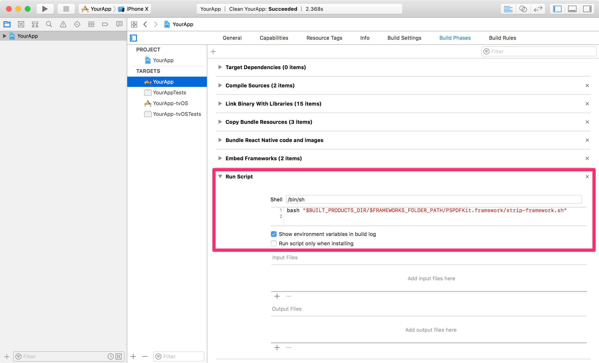
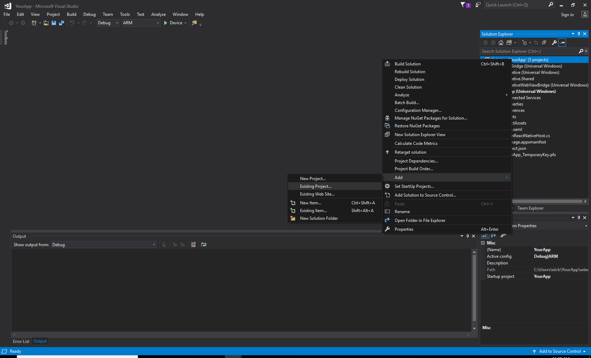
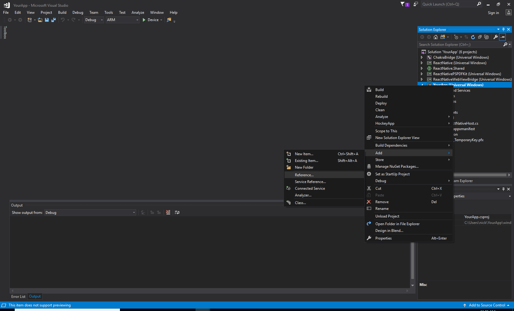
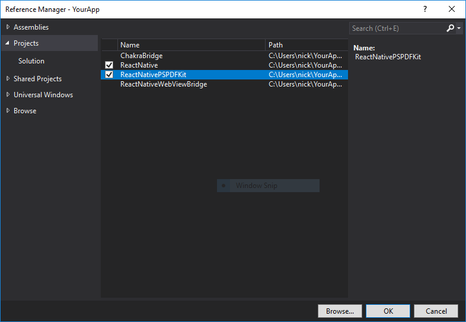
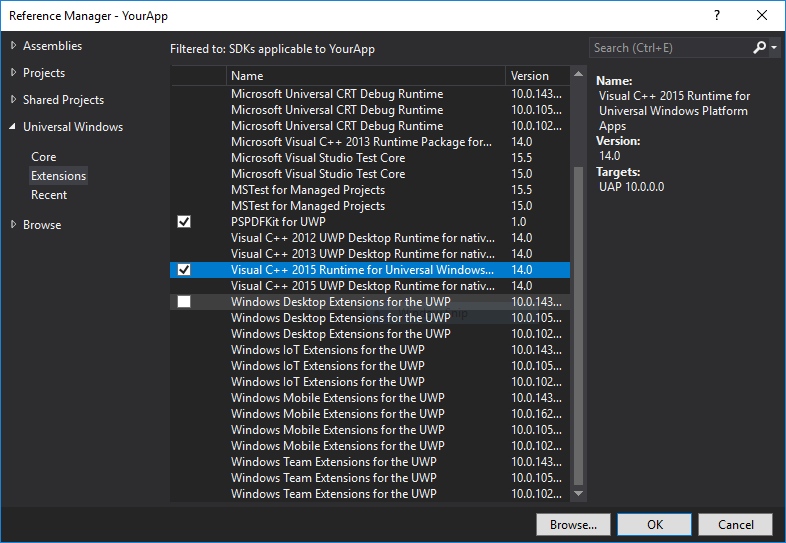

## PSPDFKit for React Native

See our [announcement blog post](https://pspdfkit.com/blog/2016/react-native-module/) for more details.

### iOS

#### Requirements
- Xcode 9.2
- PSPDFKit >= 7.0.3
- react-native >= 0.48.4

#### Getting Started

**Note:** If you want to integrate PSPDFKit using CocoaPods, use [these instructions](ios/cocoapods.md) instead.

Let's create a simple app that integrates PSPDFKit and uses the `react-native-pspdfkit` module.

1. Make sure `react-native-cli` is installed: `yarn global add react-native-cli`
2. Create the app with `react-native init YourApp`.
3. Step into your newly created app folder: `cd YourApp`
4. Install `react-native-pspdfkit` from GitHub: `yarn add github:PSPDFKit/react-native`
5. Link module `react-native-pspdfkit`: `react-native link react-native-pspdfkit` 
6. Create the folder `ios/PSPDFKit` and copy `PSPDFKit.framework` and `PSPDFKitUI.framework` into it.
7. Open `ios/YourApp.xcodeproj` in Xcode: `open ios/YourApp.xcodeproj`
8. Make sure the deployment target is set to 9.0 or higher:

9. Change "View controller-based status bar appearance" to `YES` in `Info.plist`:

10. Link with the `libRCTPSPDFKit.a` static library (if `libRCTPSPDFKit.a` is already there but greyed out, delete it and link it again): 

11. Embed `PSPDFKit.framework` and `PSPDFKitUI.framework` by drag and dropping it into the "Embedded Binaries" section of the "YourApp" target (Select "Create groups"). This will also add it to the "Linked Framworks and Libraries" section:

12. Add a new `Run Script Phase` in your target’s `Build Phases`.
**IMPORTANT:** Make sure this `Run Script Phase` is below the `Embed Frameworks` build phase.  
You can drag and drop build phases to rearrange them.  
Paste the following line in the script text field of `Run Script Phase`:
```sh
bash "$BUILT_PRODUCTS_DIR/$FRAMEWORKS_FOLDER_PATH/PSPDFKit.framework/strip-framework.sh"
```

13. Add a PDF by drag and dropping it into your Xcode project (Select "Create groups" and add to target "YourApp"). This will add the document to the "Copy Bundle Resources" build phase:

14. Replace the default component from `App.js` with a simple touch area to present the bundled PDF:

```javascript
import React, { Component } from 'react';
import {
  AppRegistry,
  StyleSheet,
  NativeModules,
  Text,
  TouchableHighlight,
  View
} from 'react-native';

var PSPDFKit = NativeModules.PSPDFKit;
PSPDFKit.setLicenseKey('INSERT_YOUR_LICENSE_KEY_HERE');

export default class App extends Component<{}> {
  _onPressButton() {
    PSPDFKit.present('document.pdf', {
        pageTransition: 'scrollContinuous',
        scrollDirection: 'vertical',
        documentLabelEnabled: true,
      })
  }
  
  render() {
    return (
      <View style={styles.container}>
        <TouchableHighlight onPress={this._onPressButton}>
          <Text style={styles.text}>Tap to Open Document</Text>
        </TouchableHighlight>
      </View>
    );
  }
}

const styles = StyleSheet.create({
  container: {
    flex: 1,
    justifyContent: 'center',
    alignItems: 'center',
    backgroundColor: '#F5FCFF',
  },
  welcome: {
    fontSize: 20,
    textAlign: 'center',
    margin: 10,
  },
  instructions: {
    textAlign: 'center',
    color: '#333333',
    marginBottom: 5,
  },
});
```

Your app is now ready to launch. Run the app in Xcode or type `react-native run-ios` in the terminal.

#### Configuration

You can configure the presentation with a configuration dictionary which is a mirror of the [`PSPDFConfiguration`](https://pspdfkit.com/api/ios/Classes/PSPDFConfiguration.html) class.

Example:

```javascript
PSPDFKit.present('document.pdf', {
  thumbnailBarMode: 'scrollable',
  pageTransition: 'scrollContinuous',
  scrollDirection: 'vertical'
})
```
  
#### Running Catalog Project

- Copy `PSPDFKit.framework` and `PSPDFKitUI.framework` into the `PSPDFKit` directory.
- Install dependencies: `yarn install` in `samples/Catalog` directory. (Because of a [bug](https://github.com/yarnpkg/yarn/issues/2165) you may need to clean `yarn`'s cache with `yarn cache clean` before.)
- Run the app with `react-native-cli`: `react-native run-ios`

#### Configuration Mapping

The PSPDFKit React Native iOS Wrapper maps most configuration options available in `PSPDFConfiguration` from JSON. Please refer to `[RCTConvert+PSPDFConfiguration.m](https://github.com/PSPDFKit/react-native/blob/master/ios/RCTPSPDFKit/Converters/RCTConvert%2BPSPDFConfiguration.m#L19)` for the complete list and for the exact naming of enum values.

Annotations are mapped based on their type name. This is case sensitive. For example, to limit annotation types to ink and highlight, use this:

```
editableAnnotationTypes: ['Ink', 'Highlight']

```


### Android

#### Requirements

- Android SDK
- Android Build Tools 23.0.1 (React Native)
- Android Build Tools 26.0.1 (PSPDFKit module)
- PSPDFKit >= 4.3.0
- react-native >= 0.52.1

#### Getting Started

Let's create a simple app that integrates PSPDFKit and uses the react-native-pspdfkit module.

1. Make sure `react-native-cli` is installed: `yarn global add react-native-cli`
2. Create the app with `react-native init YourApp`.
3. Step into your newly created app folder: `cd YourApp`.
4. Install `react-native-pspdfkit` from GitHub: `yarn add github:PSPDFKit/react-native`.
5. Link module `react-native-pspdfkit`: `react-native link react-native-pspdfkit`.
6. <a id="step-6"></a>Add PSPDFKit and Google repository to `YourApp/android/build.gradle` so PSPDFKit library and Android dependencies can be downloaded:

  ```diff
    allprojects {
        repositories {
            mavenLocal()
            jcenter()
  +         maven {
  +             url 'https://maven.google.com'
  +         }         
  +         maven {
  +             url 'https://customers.pspdfkit.com/maven/'

  +             credentials {
  +                 username 'pspdfkit'
  +                 password 'YOUR_MAVEN_KEY_GOES_HERE'
  +             }
  +         }
            maven {
                // All of React Native (JS, Obj-C sources, Android binaries) is installed from npm
                url "$rootDir/../node_modules/react-native/android"
            }
        }
    }
  ```

7. PSPDFKit targets modern platforms, so you'll have to update `compileSdkVersion` and `targetSdkVersion` to at least API 26 and enable MultiDex. In `YourApp/android/app/build.gradle` (note **five** places to edit):
    
   ```diff
   ...
   android {
   -   compileSdkVersion 23
   +   compileSdkVersion 26
   -   buildToolsVersion "23.0.1"
   +   buildToolsVersion "26.0.1" 

   defaultConfig {
       applicationId "com.yourapp"
   +   multiDexEnabled true
   -   minSdkVersion 16
   +   minSdkVersion 19
   -   targetSdkVersion 22
   +   targetSdkVersion 26
       versionCode 1
       versionName "1.0"
       ndk {
           abiFilters "armeabi-v7a", "x86"
       }
   }
   ...
   ```
     
8. <a id="step-8"></a>Enter your PSPDFKit license key into `YourApp/android/app/src/main/AndroidManifest.xml` file: 

  ```diff
     <application>
        ...

  +      <meta-data
  +          android:name="pspdfkit_license_key"
  +          android:value="YOUR_LICENSE_KEY_GOES_HERE"/>

     </application> 
  ```

9. Set primary color. In `YourApp/android/app/src/main/res/values/styles.xml` replace
  ```xml    
<!-- Customize your theme here. -->
  ```
with
  ```xml    
<item name="colorPrimary">#3C97C9</item>
  ```     
10. <a id="step-10"></a>Replace the default component from `YourApp/App.js` with a simple touch area to present a PDF document from the local device filesystem:
        
   ```javascript
   import React, { Component } from 'react';
   import {
     AppRegistry,
     StyleSheet,
     NativeModules,
     Text,
     TouchableHighlight,
     View,
     PermissionsAndroid
   } from 'react-native';
	
   var PSPDFKit = NativeModules.PSPDFKit;
	
   const DOCUMENT = "file:///sdcard/document.pdf";
   const CONFIGURATION = {
     scrollContinuously : false,
     showPageNumberOverlay : true,
     pageScrollDirection : "vertical"
   };
	
   // Change 'YourApp' to your app's name.
   export default class YourApp extends Component<{}> {
     _onPressButton() {
     requestExternalStoragePermission();
     }
        
     render() {
       return (
         <View style={styles.container}>
           <Text>{PSPDFKit.versionString}</Text>
             <TouchableHighlight onPress={this._onPressButton}>
               <Text style={styles.text}>Tap to Open Document</Text>
               </TouchableHighlight>
         </View>
       );
     }
   }
        
   async function requestExternalStoragePermission() {
     try {
       const granted = await PermissionsAndroid.request(
         PermissionsAndroid.PERMISSIONS.WRITE_EXTERNAL_STORAGE
       )
       if (granted === PermissionsAndroid.RESULTS.GRANTED) {
         console.log("Write external storage permission granted")
         PSPDFKit.present(DOCUMENT, CONFIGURATION);
       } else {
         console.log("Write external storage permission denied")
       }
     } catch (err) {
       console.warn(err)
     }
   }
        
   const styles = StyleSheet.create({
     container: {
       flex: 1,
       justifyContent: 'center',
       alignItems: 'center',
       backgroundColor: '#F5FCFF',
     },
     text: {
       fontSize: 20,
       textAlign: 'center',
       margin: 10,
     }
   });
   ```  
11. Before launching the app you need to copy a PDF document onto your development device or emulator.

	```bash
	adb push /path/to/your/document.pdf /sdcard/document.pdf
	```

12. Your app is now ready to launch.  From `YourApp` directory run `react-native run-android`.

	```bash
	react-native run-android
	```

#### Running Catalog Project

1. Clone the repository. `git clone https://github.com/PSPDFKit/react-native.git`.
2. Install dependencies: run `yarn install` from `samples/Catalog` directory. (Because of a [bug](https://github.com/yarnpkg/yarn/issues/2165) you may need to clean `yarn`'s cache with `yarn cache clean` before.)
3. Add your customer portal password to `samples/Catalog/android/build.gradle`:

  ```groovy
        maven {
            url 'https://customers.pspdfkit.com/maven/'

            credentials {
                username 'pspdfkit'
                password 'YOUR_MAVEN_PASSWORD_GOES_HERE'
            }
        }
  ```
    
4. Update license key in `samples/Catalog/android/app/src/main/AndroidManifest.xml`:

  ```xml
     <application>
        ...

        <meta-data
            android:name="pspdfkit_license_key"
            android:value="YOUR_LICENSE_KEY_GOES_HERE"/>

     </application> 
  ```

5. Catalog app is now ready to launch. From `samples/Catalog` directory run `react-native run-android`.

#### Configuration

##### Upload PDF to device 

To copy a pdf document to your local device storage:
```bash         
adb push "document.pdf" "/sdcard/document.pdf"
```

##### Bundle PDF inside the APK's assets

To bundle a pdf document in the Android app, simply copy it the Android `assets` folder, for the Catalog app is `samples/PDFs`.

##### Viewer options

You can configure the builder with a dictionary representation of the PSPDFConfiguration object. Check [`ConfigurationAdapter.java`](https://github.com/PSPDFKit/react-native/blob/master/android/src/main/java/com/pspdfkit/react/ConfigurationAdapter.java) for all the parameters available.

```javascript
const CONFIGURATION = {
	startPage : 3,
	scrollContinuously : false,
	showPageNumberOverlay : true,
	grayScale : true,
	showPageLabels : false,
	pageScrollDirection : "vertical"
};
```

#### Update
Upgrading yarn's lock file is required in order to update react-native-pspdfkit module in a project that has been already setup following the steps in [Getting Started](#getting-started-1) section.  
From root project folder (e.g.`YourApp` for upgrading example project) launch `yarn upgrade`.

##### Migrate from PSPDFKit version 2.9.x to 3.0.0
After launching `yarn upgrade`, apply [step 6](#step-6), [step 8](#step-8) and [step 10](#step-10) from [Getting Started](#getting-started-1) section.  
Enable MultiDex in `YourApp/android/app/build.gradle` (note **one** place to edit):
    
   ```diff
   ...
   android {
       compileSdkVersion 25
       buildToolsVersion "25.0.2" 

   defaultConfig {
       applicationId "com.yourapp"
   +   multiDexEnabled true
       minSdkVersion 16
       targetSdkVersion 25
       versionCode 1
       versionName "1.0"
       ndk {
           abiFilters "armeabi-v7a", "x86"
       }
   }
   ...
   ```
 Remove `pspdfkit-lib` folder in `YourApp/android/`.  
 In `YourApp/android/settings.gradle` remove the old reference to `pspdfkit-lib` (note **one** place to edit):
   
   ```diff
    project(':react-native-pspdfkit').projectDir = new File(rootProject.projectDir, '../node_modules/react-native-pspdfkit/android')  
    include ':app'
   -include ':pspdfkit-lib'
   ```
   
##### Migrate from PSPDFKit version 3.3.3 to 4.0.x
After launching `yarn upgrade`, apply [step 6](#step-6), [step 8](#step-8) and [step 10](#step-10) from [Getting Started](#getting-started-1) section.  
Enable MultiDex in `YourApp/android/app/build.gradle` (note **four** place to edit):
    
   ```diff
   ...
   android {
   -   compileSdkVersion 25
   +   compileSdkVersion 26
   -   buildToolsVersion "25.0.2" 
   +   buildToolsVersion "26.0.1" 

   defaultConfig {
       applicationId "com.yourapp"
       multiDexEnabled true
   -   minSdkVersion 16
   +   minSdkVersion 19
   -   targetSdkVersion 25
   +   targetSdkVersion 26
       versionCode 1
       versionName "1.0"
       ndk {
           abiFilters "armeabi-v7a", "x86"
       }
   }
   ...
   ```


#### API

##### Constants

The following constants are available on the PSPDFKit export:

- `versionString` (`String`) PSPDFKit version number.

##### `present(document : string, configuration : readable map) : void`

Shows the pdf `document` from the local device filesystem, or your app's assets.

- `file:///sdcard/document.pdf` will open the document from local device filesystem.
- `file:///android_asset/document.pdf` will open the document from your app's assets.

`configuration` can be empty `{}`.

### Windows UWP

#### Requirements
- Visual studio Community 2017 or greater
- git
- cmake
- npm
- PSPDFKitSDK.vsix for UWP (installed)

#### Getting Started

Let's create a simple app that integrates PSPDFKit and uses the react-native-pspdfkit module.

1. Make sure `react-native-cli` is installed: `npm install -g react-native-cli`.
2. Install the windows helper plugin: `npm install --save-dev rnpm-plugin-windows`.
3. Create the app with `react-native init YourApp`.
4. Step into your newly created app folder: `cd YourApp`.
5. Install windows tool for react native: `npm install --global --production windows-build-tools`.
6. Install `react-native-pspdfkit` from GitHub: `npm add github:PSPDFKit/react-native`.
7. Install all modules: `npm install`.
8. Link module `react-native-pspdfkit`: `react-native link react-native-pspdfkit`.
9. Initialise the windows project: `react-native windows`.
10. Open the windows solution in `react-native\YourApp\windows`.
11. Accept and install any required extensions when prompted.
12. If the settings windows opens, click on `Developer` and select `yes`.
13. Add `react-native-pspdfkit` to your soloution: Right click on the solution -> Add -> Existing Project. Navigate to `node_modules/react-native-pspdfkit/windows/ReactNativePSPDFKit/ReactNativePSPDFKit/` and select the `ReactNativePSPDFKit.csproj`

14. Mark `react-native-pspdfkit`, `PSPDFKit SDK` and `Visual C++ Runtime` as dependancies for `YourApp`: Right click on `YourApp` -> Add -> Refererece... Click on Projects and tick `ReactNativePSPDFKit`. Click on Universal Windows -> Extensions and tick `PSPDFKit for UWP` and `Visual C++ 2015 Runtime for Universal Windows Platform Apps` then click ok.



15. Add `react-native-pspdfkit` to `YourApp` package list and enter license key: open `MainReactNativeHost.cs` in `YourApp` project and add the following line.
  ```
  protected override List<IReactPackage> Packages => new List<IReactPackage>
  {
      new MainReactPackage(),
  +   new ReactNativePSPDFKit.PSPDFKitPackage("INSERT YOUR LICENSE KEY HERE")
  };
 ```
16. Save Changes: File -> Save All
17. Add the `PSPDFKitView` and `PSPDFKit` module into your `App.windows.js` file, and add a open button to allow the user to navigate the file system.
  ```
  import React, { Component } from 'react';
  import {
      AppRegistry,
      StyleSheet,
      View,
      Text,
      NativeModules,
      Button
  } from 'react-native';
  
  var PSPDFKitView = require('react-native-pspdfkit');
  var PSPDFKit = NativeModules.ReactPSPDFKit;
  
  export default class Catalog extends Component<{}> {
      constructor(props) {
        super(props);
      }
      
      render() {
          return (
          <View style={styles.page}>
              <PSPDFKitView style={styles.pdfView} />
              <View style={styles.footer}>
                  <View style={styles.button}>
                    <Button onPress={() => PSPDFKit.OpenFile()} title="Open" />
                  </View>
                  <Text style={styles.version}>SDK Version : {PSPDFKit.versionString}</Text>
              </View>
          </View>
          );
      }
  }
  
  var styles = StyleSheet.create({
      page: {
          flex: 1,
          alignItems: 'stretch',
          backgroundColor: '#eee'
      },
      pdfView: {
        flex: 1,
      },
      button: {
          width: 100,
          margin: 20
      },
      footer: {
          flexDirection: 'row',
          justifyContent: 'space-between',
          alignItems: 'center',
      },
      version: {
          color: '#666666',
          margin: 20
      }
  });
 ```
17. Now run the application on the command line: `react-native run-windows`.
18. Press Yes when Power shell wants to run.
19. Type 'y' when asking if you want to install the certificate.

#### Running Catalog Project

1. Clone the repository. `git clone https://github.com/PSPDFKit/react-native.git`.
2. From the command promt `cd react-native\samples\Catalog`.
3. Make sure `react-native-cli` is installed: `npm install -g react-native-cli`.
4. run `npm install`.
5. Open the UWP catalog solution in `react-native\samples\Catalog\windows`.
6. Accept and install any required extensions when prompted.
7. If the settings windows opens, click on `Developer` and selected `yes`.
8. Enter your license key in `react-native\samples\Catalog\windows\MainReactNativeHosts.cs`
  ```
    protected override List<IReactPackage> Packages => new List<IReactPackage>
    {
        new MainReactPackage(),
        new ReactNativePSPDFKit.PSPDFKitPackage("INSERT LICENSE KEY HERE"),
    };
  ```
9. From the command prompt run `react-native run-windows`.
10. Enter `y` to accept the certificate when prompted and allow socket access for reactive when prompted.

#### API

##### Constants

The following constants are available on the PSPDFKit export:

- `versionString` (`String`) PSPDFKit version number.

##### `OpenFile() : void`

Opens a file picker for the user to select a pdf from. When the user selects an item it will be displayed in the `<PSPDFKitView>`.

## License

This project can be used for evaluation or if you have a valid PSPDFKit license.  
All items and source code Copyright © 2010-2017 PSPDFKit GmbH.

See LICENSE for details.

## Contributing
  
Please ensure [you signed our CLA](https://pspdfkit.com/guides/web/current/miscellaneous/contributing/) so we can accept your contributions.
