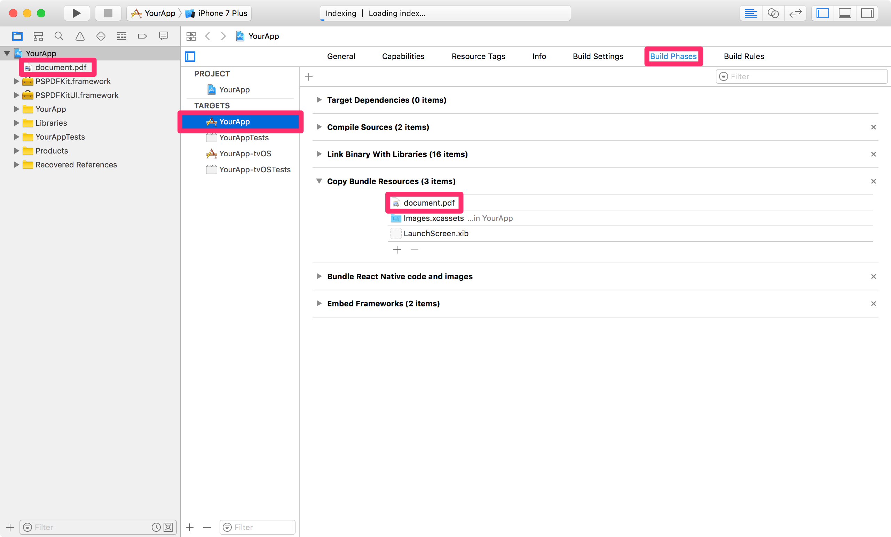

## React Native wrapper for PSPDFKit for iOS, Android & Windows UWP. (PDF SDK for React Native)


This wrapper requires a valid license of PSPDFKit. Licenses are per platform. You can request [a trial license here](https://pspdfkit.com/try/).

This wrapper exposes the most often used APIs from PSPDFKit. Many of our partners end up forking this wrapper and adding some custom code to achieve even greater integration with their products, using native code.

Windows is not currently supported, please use the previous version [1.24.9](https://github.com/PSPDFKit/react-native/releases/tag/1.24.9) instead.

#### Announcements

- [Announcement blog post](https://pspdfkit.com/blog/2016/react-native-module/)
- [React Native UI Component for iOS](https://pspdfkit.com/blog/2018/react-native-ui-component-for-ios/) ([See iOS](https://github.com/PSPDFKit/react-native#ios))
- [React Native UI Component for Android](https://pspdfkit.com/blog/2018/react-native-ui-component-for-android/) ([See Android](https://github.com/PSPDFKit/react-native#android))
- [PSPDFKit for Windows UWP with React
  Native](https://pspdfkit.com/blog/2018/introducing-pspdfkit-windows/#react-native-for-windows-support) ([See Windows UWP](https://github.com/PSPDFKit/react-native#windows-uwp))
- [How to Extend React Native APIs](https://pspdfkit.com/blog/2018/how-to-extend-react-native-api/)
- [Advanced Techniques for React Native UI Components](https://pspdfkit.com/blog/2018/advanced-techniques-for-react-native-ui-components/)
- [How to Extend React Native APIs for Windows](https://pspdfkit.com/blog/2019/how-to-extend-react-native-apis-for-windows/)
- [How to Bridge Native iOS Code to React Native](https://pspdfkit.com/blog/2020/how-to-bridge-native-ios-code-to-react-native/)

#### PSPDFKit

The [PSPDFKit SDK](https://pspdfkit.com/) is a framework that allows you to view, annotate, sign, and fill PDF forms on iOS, Android, Windows, macOS, and Web.

[PSPDFKit Instant](https://pspdfkit.com/instant) adds real-time collaboration features to seamlessly share, edit, and annotate PDF documents.

## Support, Issues and License Questions

PSPDFKit offers support for customers with an active SDK license via https://pspdfkit.com/support/request/

Are you evaluating our SDK? That's great, we're happy to help out!
To make sure this is fast, please use a work email and have someone from your company fill out our sales form: https://pspdfkit.com/sales/

### iOS

#### Requirements

- The latest [Xcode](https://developer.apple.com/xcode/).
- PSPDFKit 10.2.1 for iOS or later
- react-native >= 0.63.4
- CocoaPods >= 1.10.1

#### Getting Started

Let's create a simple app that integrates PSPDFKit and uses the `react-native-pspdfkit` module.

1. Make sure `react-native-cli` is installed: `yarn global add react-native-cli`
2. Create the app with `react-native init YourApp`
3. Step into your newly created app folder: `cd YourApp`
4. Install `react-native-pspdfkit` from GitHub: `yarn add github:PSPDFKit/react-native`
5. Install all the dependencies for the project: `yarn install`. (Because of a [bug](https://github.com/yarnpkg/yarn/issues/2165) you may need to clean `yarn`'s cache with `yarn cache clean` before.)
6. Open `ios/Podile` in a text editor: `open ios/Podfile`, update the platform to iOS 12, and add the PSPDFKit podspecs:

```diff
require_relative '../node_modules/react-native/scripts/react_native_pods'
require_relative '../node_modules/@react-native-community/cli-platform-ios/native_modules'

- platform :ios, '10.0'
+ platform :ios, '12.0'

target 'YourApp' do
  config = use_native_modules!

  use_react_native!(:path => config["reactNativePath"])

  target 'YourAppTests' do
    inherit! :complete
    # Pods for testing
  end
+ pod 'react-native-pspdfkit', :path => '../node_modules/react-native-pspdfkit'
+ pod 'PSPDFKit', podspec: 'https://customers.pspdfkit.com/pspdfkit-ios/latest.podspec'

  # Enables Flipper.
  #
  # Note that if you have use_frameworks! enabled, Flipper will not work and
  # you should disable these next few lines.
- use_flipper!
- post_install do |installer|
-   flipper_post_install(installer)
- end
end
```

7. `cd ios` then run `pod install`.
8. Open `YourApp.xcworkspace` in Xcode: `open YourApp.xcworkspace`.
9. Make sure the deployment target is set to 12.0 or higher:
   
10. Change "View controller-based status bar appearance" to `YES` in `Info.plist`:
    
11. Add a PDF by drag and dropping it into your Xcode project (Select "Create groups" and add to target "YourApp"). This will add the document to the "Copy Bundle Resources" build phase:
    
12. Replace the default component from `App.js` with a simple touch area to present the bundled PDF. (Note that you can also use a [Native UI Component](#native-ui-component) to show a PDF.)

```javascript
import React, { Component } from "react";
import {
  AppRegistry,
  StyleSheet,
  NativeModules,
  Text,
  TouchableHighlight,
  View
} from "react-native";

const PSPDFKit = NativeModules.PSPDFKit;

PSPDFKit.setLicenseKey("INSERT_YOUR_LICENSE_KEY_HERE");

// Change 'YourApp' to your app's name.
export default class YourApp extends Component<Props> {
  _onPressButton() {
    PSPDFKit.present("document.pdf", {});
  }

  render() {
    return (
      <View style={styles.container}>
        <TouchableHighlight onPress={this._onPressButton}>
          <Text style={styles.text}>Tap to Open Document</Text>
        </TouchableHighlight>
      </View>
    );
  }
}

const styles = StyleSheet.create({
  container: {
    flex: 1,
    justifyContent: "center",
    alignItems: "center",
    backgroundColor: "#F5FCFF"
  },
  text: {
    fontSize: 20,
    textAlign: "center",
    margin: 10
  }
});

// Change both 'YourApp's to your app's name.
AppRegistry.registerComponent("YourApp", () => YourApp);
```

Your app is now ready to launch. Run the app in Xcode or go back to the Terminal, then run `cd ..`, and `react-native run-ios`.

### Usage

There are 2 different ways on how to use the PSPDFKit React Native wrapper on iOS.

- Present a document via a Native Module modally.
- Show a PSPDFKit view via a Native UI component.

Depending on your needs you might want to use one or the other.

### Native Module

Using the Native Module (`PSPDFKit.present()`), you can present a document with PSPDFKit modally in fullscreen.
You can specify the path to the document you want to present, and [configuration options](#configuration).

```javascript
import React, { Component } from "react";
import { NativeModules, Text, TouchableHighlight, View } from "react-native";

var PSPDFKit = NativeModules.PSPDFKit;
PSPDFKit.setLicenseKey("YOUR_LICENSE_KEY_GOES_HERE");

export default class App extends Component<{}> {
  _onPressButton() {
    PSPDFKit.present("document.pdf", {
      pageTransition: "scrollContinuous",
      scrollDirection: "vertical",
      documentLabelEnabled: true
    });
  }

  render() {
    return (
      <View style={styles.container}>
        <TouchableHighlight onPress={this._onPressButton}>
          <Text style={styles.text}>Tap to Open Document</Text>
        </TouchableHighlight>
      </View>
    );
  }
}
```

### Native UI Component

With `PSPDFKitView` you can use PSPDFKit like any other React component in your app.
Using this approach, you have more flexibility over how a document is presented and displayed.

The layout is completely flexible, and can be adjust with flexbox.
Note that you still need to set your license key with the Native Module.

For all the `props` that you can pass to `PSPDFKitView`, have a look at the [source documentation](./index.js).

This is how you would show a PDF as a React component:

```javascript
import React, { Component } from "react";
import { NativeModules } from "react-native";
import PSPDFKitView from "react-native-pspdfkit";

var PSPDFKit = NativeModules.PSPDFKit;
PSPDFKit.setLicenseKey("YOUR_LICENSE_KEY_GOES_HERE");

export default class App extends Component<{}> {
  render() {
    return (
      <PSPDFKitView
        document={"document.pdf"}
        configuration={{
          pageTransition: "scrollContinuous",
          scrollDirection: "vertical",
          documentLabelEnabled: true
        }}
        style={{ flex: 1, color: "#267AD4" }}
      />
    );
  }
}
```

#### Configuration

You can configure the presentation with a configuration dictionary which is a mirror of the [`PSPDFConfiguration`](https://pspdfkit.com/api/ios/Classes/PSPDFConfiguration.html) class.

Example - Native Module:

```javascript
PSPDFKit.present("document.pdf", {
  thumbnailBarMode: "scrollable",
  pageTransition: "scrollContinuous",
  scrollDirection: "vertical"
});
```

Example - Native UI Component:

```javascript
<PSPDFKitView
  document={"document.pdf"}
  configuration={{
    thumbnailBarMode: "scrollable",
    pageTransition: "scrollContinuous",
    scrollDirection: "vertical"
  }}
/>
```

#### Running Catalog Project

- Clone the repository: `git clone https://github.com/PSPDFKit/react-native.git`.
- Step into your newly cloned folder: `cd react-native` and create a new `PSPDFKit` directory: `mkdir PSPDFKit`.
- [Download the latest version of PSPDFKit for iOS](https://customers.pspdfkit.com/download/binary/ios/latest) and mount the DMG file.
- Copy `PSPDFKit.xcframework` and `PSPDFKitUI.xcframework` into the `PSPDFKit` directory.
- Install dependencies: `yarn install` in `samples/Catalog` directory. (Because of a [bug](https://github.com/yarnpkg/yarn/issues/2165) you may need to clean `yarn`'s cache with `yarn cache clean` before.)
- Run the app with `react-native-cli`: `react-native run-ios`
- If you get an error about `config.h` not being found check out [this blog post](https://tuntunir.blogspot.com/2018/02/react-native-fatal-error-configh-file.html) for information on how to fix it.

#### Running the Native Catalog

Take a look at the [instructions to get started here](/samples/NativeCatalog/README.md#running-this-sample-on-ios).

#### Running on Mac Catalyst

Using PSPDFKit React Native Wrapper on Mac Catalyst does not currently work due to a [Flipper and FlipperKit issue](https://github.com/facebook/react-native/issues/28810).

If you wish to run your project on Mac Catalyst, please try the [following workaround which removes everything related to Flipper and FlipperKit](https://github.com/facebook/react-native/issues/28810#issuecomment-623357732).

#### Configuration Mapping

The PSPDFKit React Native iOS Wrapper maps most configuration options available in `PSPDFConfiguration` from JSON. Please refer to [`RCTConvert+PSPDFConfiguration.m`](./ios/RCTPSPDFKit/Converters/RCTConvert+PSPDFConfiguration.m#L267) for the complete list and for the exact naming of enum values.

Annotations are mapped based on their type name. This is case sensitive. For example, to limit annotation types to ink and highlight, use this:

```javascript
editableAnnotationTypes: ["Ink", "Highlight"];
```

#### Menu Item Mapping

The PSPDFKit React Native iOS Wrapper allows you to specify a custom grouping for the annotation creation toolbar. Please refer to [`RCTConvert+PSPDFAnnotationToolbarConfiguration.m`](./ios/RCTPSPDFKit/Converters/RCTConvert+PSPDFAnnotationToolbarConfiguration.m#L47) for the complete list of menu items. To set them just specify the `menuItemGrouping` prop on the `PSPDFKitView`. The format used is as follows:

```javascript
[
  menuItem,
  { key: menuItem, items: [subItem, subItem]},
  ...
]
```

#### Customize the Toolbar Buttons

You can customize the toolbar buttons on the Native UI View component by specifying the toolbar buttons using `setLeftBarButtonItems` and `setRightBarButtonItems`, like so:

```javascript
pdfView.setRightBarButtonItems(
  ["thumbnailsButtonItem", "searchButtonItem", "annotationButtonItem"],
  "document",
  false
);
```

Please refer to [`RCTConvert+UIBarButtonItem.m`](./ios/RCTPSPDFKit/Converters/RCTConvert%2BUIBarButtonItem.m#L14) for the complete list of bar button items.

Also, please take a look at the [ToolbarCustomization example from our Catalog app](./samples/Catalog/Catalog.ios.js#L805).

For a more detailed description of toolbar customizations, refer to our Customizing the Toolbar guide for [iOS](https://pspdfkit.com/guides/ios/current/customizing-the-interface/customizing-the-toolbar/) and [Android](https://pspdfkit.com/guides/android/current/customizing-the-interface/customizing-the-toolbar/).

#### Process Annotations

The PSPDFKit React Native Wrapper allows you to create a new document with processed (embedded, flattenned, removed, or printed) annotations on Android and iOS using the `PSPDFKit.processAnnotations(annotationChange, annotationType, sourceDocumentPath, processedDocumentPath)` function. In the snippet below, we add a button which flattens all the annotations of the document from the currently displayed `PSPDFKitView` in a newly processed PDF file:

```javascript
<View>
  <Button
    onPress={async () => {
      const processedDocumentPath =
        RNFS.DocumentDirectoryPath + "/flattened.pdf";
      // Delete the processed document if it already exists.
      RNFS.exists(processedDocumentPath)
        .then(exists => {
          if (exists) {
            RNFS.unlink(processedDocumentPath);
          }
        })
        .then(() => {
          // First, save all annotations in the current document.
          this.refs.pdfView.saveCurrentDocument().then(success => {
            if (success) {
              // Then, flatten all the annotations
              PSPDFKit.processAnnotations(
                "flatten",
                "all",
                sourceDocumentPath,
                processedDocumentPath
              )
                .then(success => {
                  if (success) {
                    // And finally, present the newly processed document with flattened annotations.
                    PSPDFKit.present(processedDocumentPath, {});
                  } else {
                    alert("Failed to embed annotations.");
                  }
                })
                .catch(error => {
                  alert(JSON.stringify(error));
                });
            } else {
              alert("Failed to save current document.");
            }
          });
        });
    }}
    title="Flatten All Annotations"
  />
</View>
```

For a runnable example, please take a look at the [AnnotationProcessing example from our Catalog app](./samples/Catalog/Catalog.ios.js#L1032).

### Android

#### Requirements

- Android SDK
- Android NDK
- Android Build Tools 23.0.1 (React Native)
- Android Build Tools 28.0.3 (PSPDFKit module)
- Android Gradle plugin >= 3.4.1
- PSPDFKit >= 6.6.0
- react-native >= 0.63.2

#### Getting Started

Let's create a simple app that integrates PSPDFKit and uses the react-native-pspdfkit module.

1. Make sure `react-native-cli` is installed: `yarn global add react-native-cli`
2. Create the app with `react-native init YourApp`.
3. Step into your newly created app folder: `cd YourApp`.
4. Add `react-native-pspdfkit` module from GitHub: `yarn add github:PSPDFKit/react-native`.
5. Install all the dependencies for the project: `yarn install`. (Because of a [bug](https://github.com/yarnpkg/yarn/issues/2165) you may need to clean `yarn`'s cache with `yarn cache clean` before.)
6. Add PSPDFKit repository to `YourApp/android/build.gradle` so PSPDFKit library can be downloaded:

```diff
...
 allprojects {
     repositories {
         mavenLocal()
+        maven {
+            url 'https://customers.pspdfkit.com/maven/'
+        }
...
```

7. PSPDFKit targets modern platforms, so you'll have to set the `minSdkVersion` to 19. In `YourApp/android/build.gradle`:

```diff
...
 buildscript {
     ext {
         buildToolsVersion = "28.0.3"
-        minSdkVersion = 16
+        minSdkVersion = 19
         compileSdkVersion = 28
         targetSdkVersion = 28
         supportLibVersion = "28.0.0"
...
```

8. We will also need to enable MultiDex support. In `YourApp/android/app/build.gradle`:

```diff
...
  defaultConfig {
      applicationId "com.yourapp"
      minSdkVersion rootProject.ext.minSdkVersion
      targetSdkVersion rootProject.ext.targetSdkVersion
      versionCode 1
      versionName "1.0"
+     multiDexEnabled true
  }
...
```

9. <a id="step-9"></a>Enter your PSPDFKit license key into `YourApp/android/app/src/main/AndroidManifest.xml` file:

```diff
   <application>
      ...

+      <meta-data
+          android:name="pspdfkit_license_key"
+          android:value="YOUR_LICENSE_KEY_GOES_HERE"/>

   </application>
```

10. Set primary color. In `YourApp/android/app/src/main/res/values/styles.xml` replace

```xml
<!-- Customize your theme here. -->
```

with

```xml
<item name="colorPrimary">#3C97C9</item>
```

11. <a id="step-11"></a>Replace the default component from `YourApp/App.js` with a simple touch area to present a PDF document from the local device filesystem:

```javascript
import React, { Component } from "react";
import {
  StyleSheet,
  NativeModules,
  Text,
  TouchableOpacity,
  View,
  PermissionsAndroid
} from "react-native";

var PSPDFKit = NativeModules.PSPDFKit;

const DOCUMENT = "file:///sdcard/document.pdf";
const CONFIGURATION = {
  scrollContinuously: false,
  showPageNumberOverlay: true,
  pageScrollDirection: "vertical"
};

// Change 'YourApp' to your app's name.
export default class YourApp extends Component<{}> {
  _onPressButton() {
    requestExternalStoragePermission();
  }

  render() {
    return (
      <View style={styles.container}>
        <Text>{PSPDFKit.versionString}</Text>
        <TouchableOpacity onPress={this._onPressButton}>
          <Text style={styles.text}>Tap to Open Document</Text>
        </TouchableOpacity>
      </View>
    );
  }
}

async function requestExternalStoragePermission() {
  try {
    const granted = await PermissionsAndroid.request(
      PermissionsAndroid.PERMISSIONS.WRITE_EXTERNAL_STORAGE
    );
    if (granted === PermissionsAndroid.RESULTS.GRANTED) {
      console.log("Write external storage permission granted");
      PSPDFKit.present(DOCUMENT, CONFIGURATION);
    } else {
      console.log("Write external storage permission denied");
    }
  } catch (err) {
    console.warn(err);
  }
}

const styles = StyleSheet.create({
  container: {
    flex: 1,
    justifyContent: "center",
    alignItems: "center",
    backgroundColor: "#F5FCFF"
  },
  text: {
    fontSize: 20,
    textAlign: "center",
    margin: 10
  }
});
```

12. Before launching the app you need to copy a PDF document onto your development device or emulator.

    ```bash
    adb push /path/to/your/document.pdf /sdcard/document.pdf
    ```

13. Your app is now ready to launch. From `YourApp` directory run `react-native run-android`.

    ```bash
    react-native run-android
    ```

#### Running Catalog Project

1. Clone the repository. `git clone https://github.com/PSPDFKit/react-native.git`.
2. Install dependencies: run `yarn install` from `samples/Catalog` directory. (Because of a [bug](https://github.com/yarnpkg/yarn/issues/2165) you may need to clean `yarn`'s cache with `yarn cache clean` before.)
3. Update license key in `samples/Catalog/android/app/src/main/AndroidManifest.xml`:

```xml
   <application>
      ...

      <meta-data
          android:name="pspdfkit_license_key"
          android:value="YOUR_LICENSE_KEY_GOES_HERE"/>

   </application>
```

4. Catalog app is now ready to launch. From `samples/Catalog` directory run `react-native run-android`.

#### Running the Native Catalog

Take a look at the [instructions to get started here](/samples/NativeCatalog/README.md#running-this-sample-on-android).

#### Configuration

##### Upload PDF to device

To copy a pdf document to your local device storage:

```bash
adb push "document.pdf" "/sdcard/document.pdf"
```

##### Bundle PDF inside the APK's assets

To bundle a pdf document in the Android app, simply copy it the Android `assets` folder, for the Catalog app is `samples/PDFs`.

##### Viewer options

You can configure the builder with a dictionary representation of the PSPDFConfiguration object. Check [`ConfigurationAdapter.java`](https://github.com/PSPDFKit/react-native/blob/master/android/src/main/java/com/pspdfkit/react/ConfigurationAdapter.java) for all the parameters available.

```javascript
const CONFIGURATION = {
  startPage: 3,
  scrollContinuously: false,
  showPageNumberOverlay: true,
  grayScale: true,
  showPageLabels: false,
  pageScrollDirection: "vertical"
};
```

#### Native UI Component

Just like on iOS we also support integrating PSPDFKit directly into the react-native view hierarchy. There are a few thing you need to consider when using this approach:

- Your activity hosting the react component needs to extend from `ReactFragmentActivity`.
- Because of [issues](https://github.com/facebook/react-native/issues/17968) in react-native our `PdfView` needs to call `layout` and `dispatchOnGlobalLayout` on every frame, this might negatively affect your apps performance or even cause it to misbehave.
- `PSPDFKitView` doesn't yet support all the features (outline, bookmarks, thubmnail grid, view settings) using `PSPDFKit.present` provides.

##### Menu Item Mapping

The PSPDFKit React Native Android Wrapper allows you to specify a custom grouping for the annotation creation toolbar. Please refer to [`ReactGroupingRule.java`](https://github.com/PSPDFKit/react-native/blob/master/android/src/main/java/com/pspdfkit/react/menu/ReactGroupingRule.java) for the complete list of menu items. To set them just specify the `menuItemGrouping` prop on the `PSPDFKitView`. The format used is as follows:

```
[
  menuItem,
  { key: menuItem, items: [subItem, subItem]},
  ...
]
```

#### Update

Upgrading yarn's lock file is required in order to update react-native-pspdfkit module in a project that has been already setup following the steps in [Getting Started](#getting-started-1) section.
From root project folder (e.g.`YourApp` for upgrading example project) launch `yarn upgrade`.

##### Migrate from PSPDFKit version 2.9.x to 3.0.0

After launching `yarn upgrade`, apply [step 7](#step-7), [step 10](#step-10) and [step 12](#step-12) from [Getting Started](#getting-started-1) section.
Enable MultiDex in `YourApp/android/app/build.gradle` (note **one** place to edit):

```diff
...
android {
    compileSdkVersion 25
    buildToolsVersion "25.0.2"

defaultConfig {
    applicationId "com.yourapp"
+   multiDexEnabled true
    minSdkVersion 16
    targetSdkVersion 25
    versionCode 1
    versionName "1.0"
    ndk {
        abiFilters "armeabi-v7a", "x86"
    }
}
...
```

Remove `pspdfkit-lib` folder in `YourApp/android/`.
 In `YourApp/android/settings.gradle` remove the old reference to `pspdfkit-lib` (note **one** place to edit):

```diff
 project(':react-native-pspdfkit').projectDir = new File(rootProject.projectDir, '../node_modules/react-native-pspdfkit/android')
 include ':app'
-include ':pspdfkit-lib'
```

##### Migrate from PSPDFKit version 3.3.3 to 4.0.x

After launching `yarn upgrade`, apply [step 6](#step-6), [step 8](#step-8) and [step 10](#step-10) from [Getting Started](#getting-started-1) section.
Enable MultiDex in `YourApp/android/app/build.gradle` (note **four** place to edit):

```diff
...
android {
-   compileSdkVersion 25
+   compileSdkVersion 26
-   buildToolsVersion "25.0.2"
+   buildToolsVersion "26.0.1"

defaultConfig {
    applicationId "com.yourapp"
    multiDexEnabled true
-   minSdkVersion 16
+   minSdkVersion 19
-   targetSdkVersion 25
+   targetSdkVersion 26
    versionCode 1
    versionName "1.0"
    ndk {
        abiFilters "armeabi-v7a", "x86"
    }
}
...
```

#### API

##### Constants

The following constants are available on the PSPDFKit export:

- `versionString` (`String`) PSPDFKit version number.

##### `present(document : string, configuration : readable map) : void`

Shows the pdf `document` from the local device filesystem, or your app's assets.

- `file:///sdcard/document.pdf` will open the document from local device filesystem.
- `file:///android_asset/document.pdf` will open the document from your app's assets.

`configuration` can be empty `{}`.

### Windows UWP

Windows UWP is not currently supported on `master`, please follow the integration steps on the [`windows-support`](https://github.com/PSPDFKit/react-native/tree/windows-support#windows-uwp) branch.

## License

This project can be used for evaluation or if you have a valid PSPDFKit license.
All items and source code Copyright © 2010-2021 PSPDFKit GmbH.

See LICENSE for details.

## Contributing

Please ensure [you signed our CLA](https://pspdfkit.com/guides/web/current/miscellaneous/contributing/) so we can accept your contributions.
