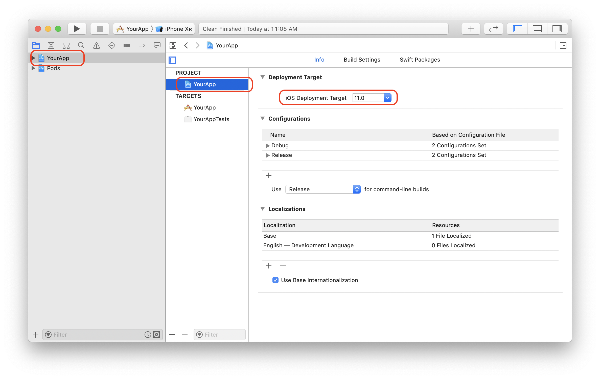
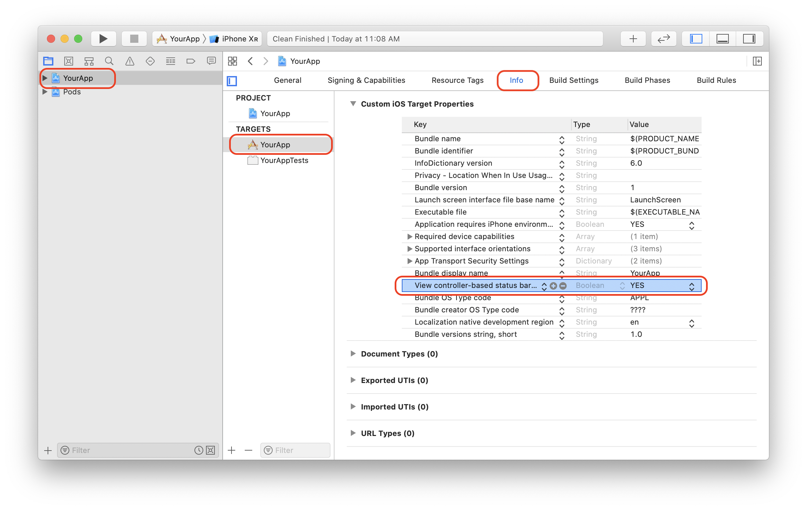
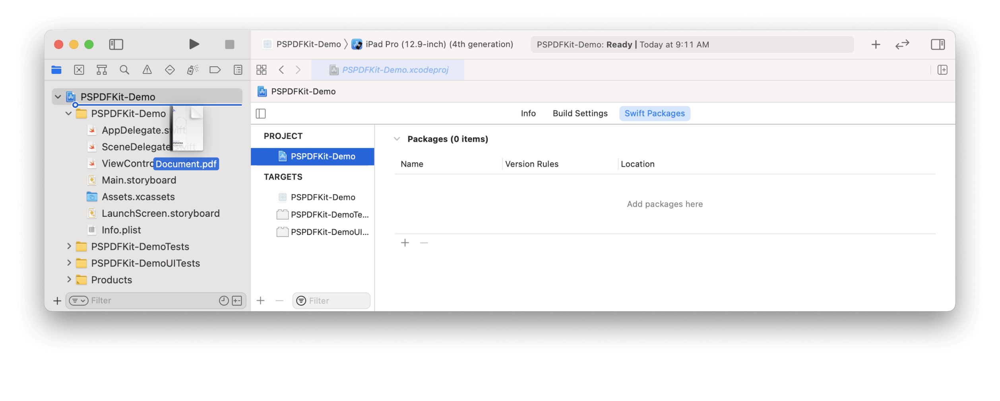

# React Native Library for PSPDFKit for iOS, Android & Windows UWP. (PDF SDK for React Native)


This library requires a valid license of PSPDFKit. Licenses are per platform.

PSPDFKit for React Native exposes the most often used APIs from PSPDFKit. Many of our partners end up forking this repository and adding some custom code to achieve even greater integration with their products, using native code.

Windows is not currently supported, please use the previous version [1.24.9](https://github.com/PSPDFKit/react-native/releases/tag/1.24.9) instead.

### Announcements

- [Announcement blog post](https://pspdfkit.com/blog/2016/react-native-module/)
- [React Native UI Component for iOS](https://pspdfkit.com/blog/2018/react-native-ui-component-for-ios/) ([See iOS](https://github.com/PSPDFKit/react-native#ios))
- [React Native UI Component for Android](https://pspdfkit.com/blog/2018/react-native-ui-component-for-android/) ([See Android](https://github.com/PSPDFKit/react-native#android))
- [PSPDFKit for Windows UWP with React
  Native](https://pspdfkit.com/blog/2018/introducing-pspdfkit-windows/#react-native-for-windows-support) ([See Windows UWP](https://github.com/PSPDFKit/react-native#windows-uwp))
- [Advances in Hybrid Technologies](https://pspdfkit.com/blog/2019/advances-in-hybrid-technologies/)
- [How to Extend React Native APIs](https://pspdfkit.com/blog/2018/how-to-extend-react-native-api/)
- [Advanced Techniques for React Native UI Components](https://pspdfkit.com/blog/2018/advanced-techniques-for-react-native-ui-components/)
- [How to Extend React Native APIs for Windows](https://pspdfkit.com/blog/2019/how-to-extend-react-native-apis-for-windows/)
- [How to Bridge Native iOS Code to React Native](https://pspdfkit.com/blog/2020/how-to-bridge-native-ios-code-to-react-native/)
- [How to Open a PDF in React Native Using the Document Picker](https://pspdfkit.com/blog/2021/how-to-open-a-pdf-in-react-native-using-the-document-browser/)
- [How to Build a React Native PDF Viewer](https://pspdfkit.com/blog/2021/how-to-build-a-react-native-pdf-viewer/)

### PSPDFKit

The [PSPDFKit SDK](https://pspdfkit.com/) is a framework that allows you to view, annotate, sign, and fill PDF forms on iOS, Android, Windows, macOS, and Web.

[PSPDFKit Instant](https://pspdfkit.com/instant) adds real-time collaboration features to seamlessly share, edit, and annotate PDF documents.

# Support, Issues and License Questions

PSPDFKit offers support for customers with an active SDK license via https://pspdfkit.com/support/request/

Are you evaluating our SDK? That's great, we're happy to help out! PSPDFKit is a commercial product and requires the purchase of a license key when used in production. By default, this library will initialize in demo mode, placing a watermark on each PDF and limiting usage to 60 minutes.

To purchase a license for production use, please reach out to us via https://pspdfkit.com/sales/form/.

To initialize PSPDFKit using a license key, call either of the following before using any other PSPDFKit APIs or features:

To set the license key for both Android and iOS, use:

```
PSPDFKit.setLicenseKeys('YOUR_REACT_NATIVE_ANDROID_LICENSE_KEY_GOES_HERE', 'YOUR_REACT_NATIVE_IOS_LICENSE_KEY_GOES_HERE');
```

To set the license key for the currently running platform, use:

```
PSPDFKit.setLicenseKey('YOUR_REACT_NATIVE_LICENSE_KEY_GOES_HERE');
```

## iOS

### Requirements

- A [development environment](https://reactnative.dev/docs/environment-setup) for running React Native projects using the React Native CLI (not the Expo CLI)
- The [latest stable version of Xcode](https://apps.apple.com/us/app/xcode/id497799835?mt=12)
- The [latest stable version of CocoaPods](https://github.com/CocoaPods/CocoaPods/releases). If you don’t already have CocoaPods installed, follow the [CocoaPods installation guide](https://guides.cocoapods.org/using/getting-started.html#installation) to install CocoaPods on your Mac.

### Getting Started

Let's create a simple app that integrates PSPDFKit and uses the `react-native-pspdfkit` module.

1. In the terminal app, change the current working directory to the location you wish to save your project. In this example, we’ll use the `~/Documents/` directory:

   ```bash
   cd ~/Documents
   ```

1. Create the React Native project by running the following command:

   ```bash
   react-native init PSPDFKitDemo
   ```

1. In the terminal app, change the location of the current working directory inside the newly created project:

   ```bash
   cd PSPDFKitDemo
   ```

1. Add the PSPDFKit library:

   ```bash
   yarn add github:PSPDFKit/react-native
   ```

1. Install all the dependencies for the project:

   ```bash
   yarn install
   ```

1. Open your project’s Podfile in a text editor to update the platform to iOS 14, and add the PSPDFKit Podspec:

   ```bash
   open ios/Podfile
   ```

   Your Podfile should look like this:

   ```diff
   require_relative '../node_modules/react-native/scripts/react_native_pods'
   require_relative '../node_modules/@react-native-community/cli-platform-ios/native_modules'

   - platform :ios, '10.0'
   + platform :ios, '14.0'

   target 'PSPDFKitDemo' do
     config = use_native_modules!

     use_react_native!(
       :path => config[:reactNativePath],
       # to enable hermes on iOS, change `false` to `true` and then install pods
       :hermes_enabled => false
     )

     target 'PSPDFKitDemoTests' do
       inherit! :complete
       # Pods for testing
     end
   + pod 'react-native-pspdfkit', :path => '../node_modules/react-native-pspdfkit'
   + pod 'PSPDFKit', podspec: 'https://customers.pspdfkit.com/pspdfkit-ios/latest.podspec'
     # Enables Flipper.
     #
     # Note that if you have use_frameworks! enabled, Flipper will not work and
     # you should disable the next line.
     use_flipper!()

     post_install do |installer|
       react_native_post_install(installer)
     end
   end
   ```

1. Change the location of the current working directory to the `ios` folder:

   ```bash
   cd ios
   ```

1. Install the CocoaPods dependencies:

   ```bash
   pod install
   ```

1. Open your project’s Workspace in Xcode:

   ```bash
   open PSPDFKitDemo.xcworkspace
   ```

1. Make sure the deployment target is set to 14.0 or higher:

   

1. Change View controller-based status bar appearance to `YES` in your project’s `Info.plist`:

   

1. Add the PDF document you want to display to your application by dragging it into your project. On the dialog that’s displayed, select Finish to accept the default integration options. You can use <a href="https://pspdfkit.com/downloads/pspdfkit-ios-quickstart-guide.pdf" download="Document.pdf">this QuickStart Guide PDF</a> as an example.

   

1. Change the location of the current working directory back to the root project folder:

   ```bash
   cd ..
   ```

1. Open your `App.js` file:

   ```bash
   open App.js
   ```

1. Replace the entire contents of `App.js` with the following code snippet:

   ```js
   import React, { Component } from "react";
   import { Platform } from "react-native";
   import PSPDFKitView from "react-native-pspdfkit";

   const DOCUMENT =
     Platform.OS === "ios"
       ? "Document.pdf"
       : "file:///android_asset/Document.pdf";
   export default class PSPDFKitDemo extends Component<{}> {
     render() {
       return (
         <PSPDFKitView
           document={DOCUMENT}
           configuration={{
             showThumbnailBar: "scrollable",
             pageTransition: "scrollContinuous",
             scrollDirection: "vertical",
           }}
           ref="pdfView"
           fragmentTag="PDF1"
           style={{ flex: 1 }}
         />
       );
     }
   }
   ```

1. The app is now ready to launch! Go back to the terminal app and run:

   ```bash
   react-native run-ios
   ```

## Usage

There are 2 different ways on how to use PSPDFKit for React Native on iOS.

- Present a document via a Native Module modally.
- Show a PSPDFKit view via a Native UI component.

Depending on your needs you might want to use one or the other.

## Native Module

Using the Native Module `PSPDFKit.present()`, you can present a document with PSPDFKit modally in fullscreen.
You can specify the path to the document you want to present, and [configuration options](#configuration).

```javascript
import React, { Component } from "react";
import { NativeModules, Text, TouchableHighlight, View } from "react-native";

export default class App extends Component<{}> {
  _onPressButton() {
    PSPDFKit.present("document.pdf", {
      pageTransition: "scrollContinuous",
      scrollDirection: "vertical",
      documentLabelEnabled: true,
    });
  }

  render() {
    return (
      <View style={styles.container}>
        <TouchableHighlight onPress={this._onPressButton}>
          <Text style={styles.text}>Tap to Open Document</Text>
        </TouchableHighlight>
      </View>
    );
  }
}
```

## Native UI Component

With `PSPDFKitView` you can use PSPDFKit like any other React component in your app.
Using this approach, you have more flexibility over how a document is presented and displayed.

The layout is completely flexible, and can be adjust with flexbox.

For all the `props` that you can pass to `PSPDFKitView`, have a look at the [source documentation](./index.js).

This is how you would show a PDF as a React component:

```javascript
import React, { Component } from "react";
import { NativeModules } from "react-native";
import PSPDFKitView from "react-native-pspdfkit";

export default class App extends Component<{}> {
  render() {
    return (
      <PSPDFKitView
        document={"document.pdf"}
        configuration={{
          pageTransition: "scrollContinuous",
          scrollDirection: "vertical",
          documentLabelEnabled: true,
        }}
        style={{ flex: 1, color: "#267AD4" }}
      />
    );
  }
}
```

### Configuration

You can configure the presentation with a configuration dictionary which is a mirror of the [`PSPDFConfiguration`](https://pspdfkit.com/api/ios/Classes/PSPDFConfiguration.html) class.

Example - Native Module:

```javascript
PSPDFKit.present("document.pdf", {
  showThumbnailBar: "scrollable",
  pageTransition: "scrollContinuous",
  scrollDirection: "vertical",
});
```

Example - Native UI Component:

```javascript
<PSPDFKitView
  document={"document.pdf"}
  configuration={{
    showThumbnailBar: "scrollable",
    pageTransition: "scrollContinuous",
    scrollDirection: "vertical",
  }}
/>
```

### Running the Catalog Project

Take a look at the [instructions to get started here](/samples/Catalog/README.md#running-the-catalog-on-ios).

### Running the Native Catalog

Take a look at the [instructions to get started here](/samples/NativeCatalog/README.md#running-this-sample-on-ios).

### Running on Mac Catalyst

Using PSPDFKit for React Native on Mac Catalyst does not currently work due to a [Flipper and FlipperKit issue](https://github.com/facebook/react-native/issues/28810).

If you wish to run your project on Mac Catalyst, please try the [following workaround which removes everything related to Flipper and FlipperKit](https://github.com/facebook/react-native/issues/28810#issuecomment-623357732).

### Configuration Mapping

On iOS, PSPDFKit for React Native iOS maps most configuration options available in `PSPDFConfiguration` from JSON. Take a look at the [list of all configuration options](/documentation/configuration-options.md) for more information. For the iOS-specific implementation, check out [`RCTConvert+PSPDFConfiguration.m`](./ios/RCTPSPDFKit/Converters/RCTConvert+PSPDFConfiguration.m#L267) for the complete list and for the exact naming of enum values.

Annotations are mapped based on their type name. This is case sensitive. For example, to limit annotation types to ink and highlight, use this:

```javascript
editableAnnotationTypes: ["Ink", "Highlight"];
```

### Menu Item Mapping

On iOS, PSPDFKit for React Native allows you to specify a custom grouping for the annotation creation toolbar. Please refer to [`RCTConvert+PSPDFAnnotationToolbarConfiguration.m`](./ios/RCTPSPDFKit/Converters/RCTConvert+PSPDFAnnotationToolbarConfiguration.m#L47) for the complete list of menu items. To set them just specify the `menuItemGrouping` prop on the `PSPDFKitView`. The format used is as follows:

```javascript
[
  menuItem,
  { key: menuItem, items: [subItem, subItem]},
  ...
]
```

### Customize the Toolbar Buttons

You can customize the toolbar buttons on the Native UI View component by specifying the toolbar buttons using `setLeftBarButtonItems` and `setRightBarButtonItems`, like so:

```javascript
pdfView.setRightBarButtonItems(
  ["thumbnailsButtonItem", "searchButtonItem", "annotationButtonItem"],
  "document",
  false
);
```

Please refer to [`RCTConvert+UIBarButtonItem.m`](./ios/RCTPSPDFKit/Converters/RCTConvert%2BUIBarButtonItem.m#L14) for the complete list of bar button items.

Also, please take a look at the [ToolbarCustomization example from our Catalog app](./samples/Catalog/Catalog.js).

For a more detailed description of toolbar customizations, refer to our Customizing the Toolbar guide for [iOS](https://pspdfkit.com/guides/ios/current/customizing-the-interface/customizing-the-toolbar/) and [Android](https://pspdfkit.com/guides/android/current/customizing-the-interface/customizing-the-toolbar/).

### Process Annotations

PSPDFKit for React Native allows you to create a new document with processed (embedded, flattenned, removed, or printed) annotations on Android and iOS using the `PSPDFKit.processAnnotations(annotationChange, annotationType, sourceDocumentPath, processedDocumentPath)` function. In the snippet below, we add a button which flattens all the annotations of the document from the currently displayed `PSPDFKitView` in a newly processed PDF file:

```javascript
<View>
  <Button
    onPress={async () => {
      const processedDocumentPath =
        RNFS.DocumentDirectoryPath + "/flattened.pdf";
      // Delete the processed document if it already exists.
      RNFS.exists(processedDocumentPath)
        .then((exists) => {
          if (exists) {
            RNFS.unlink(processedDocumentPath);
          }
        })
        .then(() => {
          // First, save all annotations in the current document.
          this.refs.pdfView.saveCurrentDocument().then((success) => {
            if (success) {
              // Then, flatten all the annotations
              PSPDFKit.processAnnotations(
                "flatten",
                "all",
                sourceDocumentPath,
                processedDocumentPath
              )
                .then((success) => {
                  if (success) {
                    // And finally, present the newly processed document with flattened annotations.
                    PSPDFKit.present(processedDocumentPath, {});
                  } else {
                    alert("Failed to embed annotations.");
                  }
                })
                .catch((error) => {
                  alert(JSON.stringify(error));
                });
            } else {
              alert("Failed to save current document.");
            }
          });
        });
    }}
    title="Flatten All Annotations"
  />
</View>
```

For a runnable example, please take a look at the [AnnotationProcessing example from our Catalog app](./samples/Catalog/Catalog.js).

## Android

### Requirements

- A [development environment](https://reactnative.dev/docs/environment-setup) for running React Native projects using the React Native CLI (not the Expo CLI)
- The [latest stable version of Android Studio](https://developer.android.com/studio)
- The [Android NDK](https://developer.android.com/studio/projects/install-ndk)
- An [Android Virtual Device](https://developer.android.com/studio/run/managing-avds.html) or a hardware device

### Getting Started

Let's create a simple app that integrates PSPDFKit and uses the `react-native-pspdfkit` module.

1. In the terminal app, change the current working directory to the location you wish to save your project. In this example, we’ll use the `~/Documents/` directory:

   ```bash
   cd ~/Documents
   ```

1. Create the React Native project by running the following command:

   ```bash
   react-native init PSPDFKitDemo
   ```

1. In the terminal app, change the location of the current working directory inside the newly created project:

   ```bash
   cd PSPDFKitDemo
   ```

1. Add the PSPDFKit library:

   ```bash
   yarn add github:PSPDFKit/react-native
   ```

1. Install all the dependencies for the project:

   ```bash
   yarn install
   ```

1. Open your project’s `build.gradle` file:

   ```bash
   open android/build.gradle
   ```

1. Add the PSPDFKit repository to download the PSPDFKit library:

   ```diff
   ...
    allprojects {
        repositories {
            mavenLocal()
   +        maven {
   +            url 'https://customers.pspdfkit.com/maven/'
   +        }
   ...
   ```

1. Open the app’s `build.gradle` file:

   ```bash
   open android/app/build.gradle
   ```

1. Enable `multidex` support:

   ```diff
   ...
     defaultConfig {
         applicationId 'com.pspdfkitdemo'
         minSdkVersion rootProject.ext.minSdkVersion
         targetSdkVersion rootProject.ext.targetSdkVersion
         versionCode 1
         versionName '1.0'
   +     multiDexEnabled true
     }
   ...
   ```

1. Add the PDF document you want to display to your application. You can download <a href="https://pspdfkit.com/downloads/pspdfkit-android-quickstart-guide.pdf" download="Document.pdf">this QuickStart Guide PDF</a> as an example.

1. Create the `assets` directory:

   ```bash
   mkdir android/app/src/main/assets
   ```

1. Copy a PDF document into your `assets` directory:

   ```bash
   cp ~/Downloads/Document.pdf android/app/src/main/assets/Document.pdf
   ```

1. Open your `App.js` file:

   ```bash
   open App.js
   ```

1. Replace the entire contents of `App.js` with the following code snippet:

   ```js
   import React, { Component } from "react";
   import { Platform } from "react-native";
   import PSPDFKitView from "react-native-pspdfkit";

   const DOCUMENT =
     Platform.OS === "ios"
       ? "Document.pdf"
       : "file:///android_asset/Document.pdf";
   export default class PSPDFKitDemo extends Component<{}> {
     render() {
       return (
         <PSPDFKitView
           document={DOCUMENT}
           configuration={{
             showThumbnailBar: "scrollable",
             pageTransition: "scrollContinuous",
             scrollDirection: "vertical",
           }}
           ref="pdfView"
           fragmentTag="PDF1"
           style={{ flex: 1 }}
         />
       );
     }
   }
   ```

1. The app is now ready to launch! Go back to the terminal app and run:

   ```bash
   react-native run-android
   ```

### Running the Catalog Project

Take a look at the [instructions to get started here](/samples/Catalog/README.md#running-the-catalog-on-android).

### Running the Native Catalog

Take a look at the [instructions to get started here](/samples/NativeCatalog/README.md#running-this-sample-on-android).

### Configuration

#### Upload PDF to device

To copy a pdf document to your local device storage:

```bash
adb push "document.pdf" "/sdcard/document.pdf"
```

#### Bundle PDF inside the APK's assets

To bundle a pdf document in the Android app, simply copy it the Android `assets` folder, for the Catalog app is `samples/PDFs`.

#### Viewer options

You can configure the builder with a dictionary representation of the PSPDFConfiguration object. Take a look at the [list of all configuration options](/documentation/configuration-options.md) for more information. For the Android-specific implementation, check out [`ConfigurationAdapter.java`](https://github.com/PSPDFKit/react-native/blob/master/android/src/main/java/com/pspdfkit/react/ConfigurationAdapter.java).

```javascript
const CONFIGURATION = {
  pageTransition: "scrollPerSpread",
  showPageNumberOverlay: true,
  grayScale: true,
  showPageLabels: false,
  scrollDirection: "vertical",
};
```

### Native UI Component

Just like on iOS we also support integrating PSPDFKit directly into the react-native view hierarchy. There are a few thing you need to consider when using this approach:

- Your activity hosting the react component needs to extend from `ReactFragmentActivity`.
- Because of [issues](https://github.com/facebook/react-native/issues/17968) in react-native our `PdfView` needs to call `layout` and `dispatchOnGlobalLayout` on every frame, this might negatively affect your apps performance or even cause it to misbehave.
- `PSPDFKitView` doesn't yet support all the features (outline, bookmarks, thubmnail grid, view settings) using `PSPDFKit.present` provides.

#### Menu Item Mapping

On Android, PSPDFKit for React Native allows you to specify a custom grouping for the annotation creation toolbar. Please refer to [`ReactGroupingRule.java`](https://github.com/PSPDFKit/react-native/blob/master/android/src/main/java/com/pspdfkit/react/menu/ReactGroupingRule.java) for the complete list of menu items. To set them just specify the `menuItemGrouping` prop on the `PSPDFKitView`. The format used is as follows:

```
[
  menuItem,
  { key: menuItem, items: [subItem, subItem]},
  ...
]
```

### Update

Upgrading yarn's lock file is required in order to update react-native-pspdfkit module in a project that has been already setup following the steps in [Getting Started](#getting-started-1) section.
From root project folder (e.g.`YourApp` for upgrading example project) launch `yarn upgrade`.

#### Migrate from PSPDFKit version 2.9.x to 3.0.0

After launching `yarn upgrade`, apply [step 7](#step-7), [step 10](#step-10) and [step 12](#step-12) from [Getting Started](#getting-started-1) section.
Enable MultiDex in `YourApp/android/app/build.gradle` (note **one** place to edit):

```diff
...
android {
    compileSdkVersion 25
    buildToolsVersion "25.0.2"

defaultConfig {
    applicationId "com.yourapp"
+   multiDexEnabled true
    minSdkVersion 16
    targetSdkVersion 25
    versionCode 1
    versionName "1.0"
    ndk {
        abiFilters "armeabi-v7a", "x86"
    }
}
...
```

Remove `pspdfkit-lib` folder in `YourApp/android/`.
In `YourApp/android/settings.gradle` remove the old reference to `pspdfkit-lib` (note **one** place to edit):

```diff
 project(':react-native-pspdfkit').projectDir = new File(rootProject.projectDir, '../node_modules/react-native-pspdfkit/android')
 include ':app'
-include ':pspdfkit-lib'
```

#### Migrate from PSPDFKit version 3.3.3 to 4.0.x

After launching `yarn upgrade`, apply [step 6](#step-6), [step 8](#step-8) and [step 10](#step-10) from [Getting Started](#getting-started-1) section.
Enable MultiDex in `YourApp/android/app/build.gradle` (note **four** place to edit):

```diff
...
android {
-   compileSdkVersion 25
+   compileSdkVersion 26
-   buildToolsVersion "25.0.2"
+   buildToolsVersion "26.0.1"

defaultConfig {
    applicationId "com.yourapp"
    multiDexEnabled true
-   minSdkVersion 16
+   minSdkVersion 19
-   targetSdkVersion 25
+   targetSdkVersion 26
    versionCode 1
    versionName "1.0"
    ndk {
        abiFilters "armeabi-v7a", "x86"
    }
}
...
```

## Windows UWP

Windows UWP is not currently supported on `master`, please follow the integration steps on the [`windows-support`](https://github.com/PSPDFKit/react-native/tree/windows-support#windows-uwp) branch.

# Troubleshooting

For Troubleshooting common issues you might encounter when setting up PSPDFKit for React Native, please refer to the [Troubleshooting](https://pspdfkit.com/guides/react-native/troubleshoot/) section.

## License

This project can be used for evaluation or if you have a valid PSPDFKit license.
All items and source code Copyright © 2010-2022 PSPDFKit GmbH.

See [LICENSE](./LICENSE) for details.
