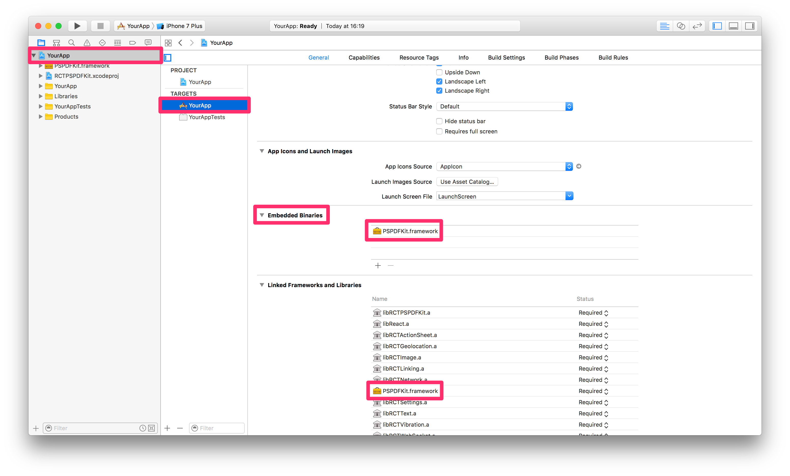

## PSPDFKit for React Native

### iOS

#### Requirements
- Xcode 8
- PSPDFKit 6
- react-native >= 0.34.1

#### Getting Started

Lets create a simple app that integrates `PSPDFKit.framework` and uses the `react-native-pspdfkit` module.

1. Make sure `react-native-cli` is installed: `npm install -g react-native-cli`
2. Create the app with `react-native init YourApp`.
3. Step into your newly created app folder: `cd YourApp`
4. Install `react-native-pspdfkit` from GitHub: `react-native install github:PSPDFKit/react-native`
5. Create the folder `ios/PSPDFKit` and copy `PSPDFKit.framework` into it.
6. Open `ios/YourApp.xcodeproj` in Xcode: `open ios/YourApp.xcodeproj`
7. Make sure the deployment target is set to 9.0 or higher:

8. Change "View controller-based status bar appearance" to `YES` in `Info.plist`:

9. Open `node_modules/react-native-pspdfkit/ios` and drag and drop `RCTPSPDFKit.xcodproj` into the YourApp Xcode project:

10. Link with the `libRCTPSPDFKit.a` static library:

11. Embed `PSPDFKit.framework` by drag and dropping it into the "Embedded Binaries" section of the "YourApp" target (Select "Create groups"). This will also add it to the "Linked Framworks and Libraries" section:

12. Add a PDF by drag and dropping it into your Xcode project (Select "Create groups" and add to target "YourApp"). This will add the document to the "Copy Bundle Resources" build phase:

13. Replace the default component from `index.ios.js` with a simple touch area to present the bundled PDF:

```javascript
import React, { Component } from 'react';
import {
  AppRegistry,
  StyleSheet,
  NativeModules,
  Text,
  TouchableHighlight,
  View
} from 'react-native';

var PSPDFKit = NativeModules.PSPDFKit;

PSPDFKit.setLicenseKey('INSERT_YOUR_LICENSE_KEY_HERE');

// Change 'YourApp' to your app's name.
class YourApp extends Component {
  _onPressButton() {
    PSPDFKit.present('document.pdf', {})
  }
  
  render() {
    return (
      <View style={styles.container}>
        <TouchableHighlight onPress={this._onPressButton}>
          <Text style={styles.text}>Tap to Open Document</Text>
        </TouchableHighlight>
      </View>
    );
  }
}

const styles = StyleSheet.create({
  container: {
    flex: 1,
    justifyContent: 'center',
    alignItems: 'center',
    backgroundColor: '#F5FCFF',
  },
  text: {
    fontSize: 20,
    textAlign: 'center',
    margin: 10,
  }
});

// Change both 'YourApp's to your app's name.
AppRegistry.registerComponent('YourApp', () => YourApp);
```

Your app is now ready to launch. Run the app in Xcode or type `react-native run-ios` in the terminal.

#### Configuration

You can configure the presentation with a configuration dictionary which is a mirror of the [`PSPDFConfiguration`](https://pspdfkit.com/api/ios/Classes/PSPDFConfiguration.html) class.

Example:

```javascript
PSPDFKit.present('document.pdf', {
  thumbnailBarMode: 'scrollable',
  pageTransition: 'scrollContinuous',
  scrollDirection: 'vertical'
})
```
  
#### Running Catalog Project

- Copy `PSPDFKit.framework` into the `PSPDFKit` directory.
- Install npm packages: `npm install` in `samples/Catalog` directory.
- Run the app with `react-native-cli`: `react-native run-ios`

### Android

#### Requirements

- Android SDK
- PSPDFKit 7
- react-native >= 0.34.1

#### Getting Started

Let's create a simple app that integrates `pspdfkit-*.aar` and uses the react-native-pspdfkit module.

1. Make sure `react-native-cli` is installed: `npm install -g react-native-cli`
2. Create the app with `react-native init YourApp`.
3. Step into your newly created app folder: `cd YourApp`.
4. Install `react-native-pspdfkit` from GitHub: `react-native install github:PSPDFKit/react-native`.
5. Add dependencies to `YourApp/node_modules/react-native-pspdfkit/android/build.gradle`.
   
    A complete list of the dependencies needed can be found in the [documentation](https://pspdfkit.com/guides/android/current/getting-started/integrating-pspdfkit/#toc_manual-library-file-integration) step 6, under `Manual library file integration`.
    
    For PSPDFKit 2.7 :

  ```                                     
dependencies {
...
//compile 'com.pspdfkit:pspdfkit:2.6.0@aar' <-- DO NOT ADD THE LIBRARY ITSELF
compile 'com.android.support:support-v4:23.4.+'
compile 'com.android.support:appcompat-v7:23.4.+'
compile "com.android.support:recyclerview-v7:23.4.+"
compile "com.android.support:cardview-v7:23.4.+"
compile "com.android.support:design:23.4.+"
compile 'io.reactivex:rxjava:1.2.0'
compile 'io.reactivex:rxandroid:1.2.1'
compile 'com.getkeepsafe.relinker:relinker:1.2.2'
	}
  ```

6. Add the following lines to `YourApp/android/settings.gradle` file:

  ```   
include ':pspdfkit-lib'
include ':react-native-pspdfkit'
project(':react-native-pspdfkit').projectDir = new File(settingsDir, '../node_modules/react-native-pspdfkit/android')
  ```
        
7. Create new `pspdfkit-lib` folder in `YourApp/android`.
8. Create new `build.gradle` file in `YourApp/android/pspdfkit-lib` and add the following lines:
     
  ```  
configurations.maybeCreate("default")
def library =  fileTree(".").filter { it.isFile()}.filter {it.name.endsWith('.aar')}.files.name.first()
artifacts.add("default", file(library))
  ```
        
9. Copy `pspdfkit-*.aar` library in `YourApp/android/pspdfkit-lib`.
10. Add the following dependencies to `YourApp/android/app/build.gradle` file:
     
  ```
dependencies {
...
compile project(':react-native-pspdfkit')
compile project(':pspdfkit-lib')
	}
  ```
        
11. Add `PSPDFKitPackage` to `MainApplication.java` in `YourApp/android/app/src/main/java/com/yourapp` (note **two** places to edit):

  ```diff
package com.yourapp;
import android.app.Application;
import android.util.Log;
import com.facebook.react.ReactApplication;
import com.facebook.react.ReactInstanceManager;
import com.facebook.react.ReactNativeHost;
import com.facebook.react.ReactPackage;
import com.facebook.react.shell.MainReactPackage;
+ import com.react.pspdfkit.PSPDFKitPackage;
.....
public class MainApplication extends Application implements ReactApplication {
  private final ReactNativeHost mReactNativeHost = new ReactNativeHost(this) {
    @Override
    protected boolean getUseDeveloperSupport() {
      return BuildConfig.DEBUG;
    }   
    @Override
    protected List<ReactPackage> getPackages() {
       return Arrays.<ReactPackage>asList(
+          new PSPDFKitPackage(),
               new MainReactPackage()
        );
    }
  };
  .....
}
  ```
     
12. Set primary color. In `YourApp/android/app/src/main/res/values/style.xml` replace
  ```xml    
<!-- Customize your theme here. -->
  ```
with
  ```xml    
<item name="colorPrimary">#3C97C9</item>
  ```     
13. Replace the default component from `index.android.js` with a simple touch area to present the bundled PDF:

  ```javascript
import React, { Component } from 'react';
import {
AppRegistry,
StyleSheet,
NativeModules,
Text,
TouchableHighlight,
View
} from 'react-native';

var PSPDFKit = NativeModules.PSPDFKit;

const DOCUMENT = "document.pdf";
const LICENSE = "LICENSE_KEY_GOES_HERE";
const CONFIGURATION = {
scrollContinuously : false,
showPageNumberOverlay : true,
pageScrollDirection : "vertical"
};

// Change 'YourApp' to your app's name.
class YourApp extends Component {
_onPressButton() {
  PSPDFKit.presentLocal(DOCUMENT, LICENSE, CONFIGURATION);
}

render() {
  return (
    <View style={styles.container}>
    <Text>{PSPDFKit.VERSION}</Text>
      <TouchableHighlight onPress={this._onPressButton}>
        <Text style={styles.text}>Tap to Open Document</Text>
      </TouchableHighlight>
    </View>
  );
}
}

const styles = StyleSheet.create({
container: {
  flex: 1,
  justifyContent: 'center',
  alignItems: 'center',
  backgroundColor: '#F5FCFF',
},
text: {
  fontSize: 20,
  textAlign: 'center',
  margin: 10,
}
});

// Change both 'YourApp's to your app's name.
AppRegistry.registerComponent('YourApp', () => YourApp);

  ```  

Your app is now ready to launch. From `YourApp` directory run `react-native run-android`.

#### Running Catalog Project

1. Clone the repository. `git clone https://github.com/PSPDFKit/react-native.git`.
2. Add dependencies to `android/build.gradle`.

    A complete list of the dependencies needed can be found in the [documentation](https://pspdfkit.com/guides/android/current/getting-started/integrating-pspdfkit/#toc_manual-library-file-integration) step 6, under `Manual library file integration`.

    For PSPDFKit 2.7 :
                                     
  ```       
dependencies {
...
//compile 'com.pspdfkit:pspdfkit:2.6.0@aar' <-- DO NOT ADD THE LIBRARY ITSELF
compile 'com.android.support:support-v4:23.4.+'
compile 'com.android.support:appcompat-v7:23.4.+'
compile "com.android.support:recyclerview-v7:23.4.+"
compile "com.android.support:cardview-v7:23.4.+"
compile "com.android.support:design:23.4.+"
compile 'io.reactivex:rxjava:1.2.0'
compile 'io.reactivex:rxandroid:1.2.1'
compile 'com.getkeepsafe.relinker:relinker:1.2.2'
    }
  ```
  
3. Copy `pspdfkit-*.aar` library in `samples/Catalog/android/pspdfkit-lib`.
4. Install npm packages: run `npm install` from `samples/Catalog` directory.
5. Catalog app is now ready to launch. From `samples/Catalog` directory run `react-native run-android`.

#### Configuration

To copy a pdf document to your local device storage:
```bash         
adb push "document.pdf" "/sdcard/document.pdf"
```

To bundle a pdf document in the Android app, simply copy it the Android `assets` folder, for the Catalog app is `samples/PDFs`.

You can configure the builder with a dictionary representation of the PSPDFConfiguration object. Check `ConfigurationAdapter.java` for all the parameters available.

Example:

```javascript
const CONFIGURATION = {
          startPage : 3,
          scrollContinuously : false,
          showPageNumberOverlay : true,
          grayScale : true,
          showPageLabels : false,
          pageScrollDirection : "vertical"
        };
})
```

## License

This project can be used for evaluation or if you have a valid PSPDFKit license.  
All items and source code Copyright © 2010-2016 PSPDFKit GmbH.

See LICENSE for details.
