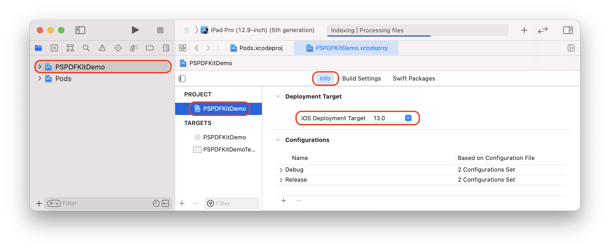

## React Native wrapper for PSPDFKit for iOS, Android & Windows. (PDF SDK for React Native)


This wrapper requires a valid license of PSPDFKit. Licenses are per platform. You can request [a trial license here](https://pspdfkit.com/try/).

#### Announcements

- [Announcement blog post](https://pspdfkit.com/blog/2016/react-native-module/)
- [React Native UI Component for iOS](https://pspdfkit.com/blog/2018/react-native-ui-component-for-ios/) ([See iOS](https://github.com/PSPDFKit/react-native#ios))
- [React Native UI Component for Android](https://pspdfkit.com/blog/2018/react-native-ui-component-for-android/) ([See Android](https://github.com/PSPDFKit/react-native#android))
- [PSPDFKit for Windows UWP with React
  Native](https://pspdfkit.com/blog/2018/introducing-pspdfkit-windows/#react-native-for-windows-support) ([See Windows UWP](https://github.com/PSPDFKit/react-native#windows-uwp))
- [How to Extend React Native APIs](https://pspdfkit.com/blog/2018/how-to-extend-react-native-api/)
- [Advanced Techniques for React Native UI Components](https://pspdfkit.com/blog/2018/advanced-techniques-for-react-native-ui-components/)

#### PSPDFKit

The [PSPDFKit SDK](https://pspdfkit.com/) is a framework that allows you to view, annotate, sign, and fill PDF forms on iOS, Android, Windows, macOS, and Web.

[PSPDFKit Instant](https://pspdfkit.com/instant) adds real-time collaboration features to seamlessly share, edit, and annotate PDF documents.

### iOS

#### Requirements

- Xcode 10.1
- PSPDFKit 8.1.3 for iOS or later
- react-native >= 0.57.8

#### Getting Started

**Note:** If you want to integrate PSPDFKit using CocoaPods, use [these instructions](ios/cocoapods.md) instead.

Let's create a simple app that integrates PSPDFKit and uses the `react-native-pspdfkit` module.

1. Make sure `react-native-cli` is installed: `yarn global add react-native-cli`
2. Create the app with `react-native init YourApp`.
3. Step into your newly created app folder: `cd YourApp`
4. Install `react-native-pspdfkit` from GitHub: `yarn add github:PSPDFKit/react-native`
5. Install all the dependencies for the project: `yarn install`. (Because of a [bug](https://github.com/yarnpkg/yarn/issues/2165) you may need to clean `yarn`'s cache with `yarn cache clean` before.)
6. Link module `react-native-pspdfkit`: `react-native link react-native-pspdfkit`.
7. Create the folder `ios/PSPDFKit` and copy `PSPDFKit.framework` and `PSPDFKitUI.framework` into it.
8. Open `ios/YourApp.xcodeproj` in Xcode: `open ios/YourApp.xcodeproj`
9. Make sure the deployment target is set to 10.0 or higher:
   
10. Change "View controller-based status bar appearance" to `YES` in `Info.plist`:
    
11. Link with the `libRCTPSPDFKit.a` static library (if `libRCTPSPDFKit.a` is already there but greyed out, delete it and link it again):
    
12. Embed `PSPDFKit.framework` and `PSPDFKitUI.framework` by drag and dropping it into the "Embedded Binaries" section of the "YourApp" target (Select "Create groups"). This will also add it to the "Linked Framworks and Libraries" section:
    
13. Add a new `Run Script Phase` in your target’s `Build Phases`.
    **IMPORTANT:** Make sure this `Run Script Phase` is below the `Embed Frameworks` build phase.  
    You can drag and drop build phases to rearrange them.  
    Paste the following line in the script text field of `Run Script Phase`:

```sh
bash "$BUILT_PRODUCTS_DIR/$FRAMEWORKS_FOLDER_PATH/PSPDFKit.framework/strip-framework.sh"
```


14. Add a PDF by drag and dropping it into your Xcode project (Select "Create groups" and add to target "YourApp"). This will add the document to the "Copy Bundle Resources" build phase:
    
15. Replace the default component from `App.js` with a simple touch area to present the bundled PDF. (Note that you can also use a [Native UI Component](#native-ui-component) to show a PDF.)

```javascript
import React, { Component } from "react";
import {
  AppRegistry,
  StyleSheet,
  NativeModules,
  Text,
  TouchableHighlight,
  View
} from "react-native";

var PSPDFKit = NativeModules.PSPDFKit;
PSPDFKit.setLicenseKey("YOUR_LICENSE_KEY_GOES_HERE");

export default class App extends Component<{}> {
  _onPressButton() {
    PSPDFKit.present("document.pdf", {
      pageTransition: "scrollContinuous",
      scrollDirection: "vertical",
      documentLabelEnabled: true
    });
  }

  render() {
    return (
      <View style={styles.container}>
        <TouchableHighlight onPress={this._onPressButton}>
          <Text style={styles.text}>Tap to Open Document</Text>
        </TouchableHighlight>
      </View>
    );
  }
}

const styles = StyleSheet.create({
  container: {
    flex: 1,
    justifyContent: "center",
    alignItems: "center",
    backgroundColor: "#F5FCFF"
  },
  welcome: {
    fontSize: 20,
    textAlign: "center",
    margin: 10
  },
  instructions: {
    textAlign: "center",
    color: "#333333",
    marginBottom: 5
  }
});
```

Your app is now ready to launch. Run the app in Xcode or type `react-native run-ios` in the terminal.

### Usage

There are 2 different ways on how to use the PSPDFKit React Native wrapper on iOS.

- Present a document via a Native Module modally.
- Show a PSPDFKit view via a Native UI component.

Depending on your needs you might want to use one or the other.

### Native Module

Using the Native Module (`PSPDFKit.present()`), you can present a document with PSPDFKit modally in fullscreen.
You can specify the path to the document you want to present, and [configuration options](#configuration).

```javascript
import React, { Component } from "react";
import { NativeModules, Text, TouchableHighlight, View } from "react-native";

var PSPDFKit = NativeModules.PSPDFKit;
PSPDFKit.setLicenseKey("YOUR_LICENSE_KEY_GOES_HERE");

export default class App extends Component<{}> {
  _onPressButton() {
    PSPDFKit.present("document.pdf", {
      pageTransition: "scrollContinuous",
      scrollDirection: "vertical",
      documentLabelEnabled: true
    });
  }

  render() {
    return (
      <View style={styles.container}>
        <TouchableHighlight onPress={this._onPressButton}>
          <Text style={styles.text}>Tap to Open Document</Text>
        </TouchableHighlight>
      </View>
    );
  }
}
```

### Native UI Component

With `PSPDFKitView` you can use PSPDFKit like any other React component in your app.
Using this approach, you have more flexibility over how a document is presented and displayed.

The layout is completely flexible, and can be adjust with flexbox.
Note that you still need to set your license key with the Native Module.

For all the `props` that you can pass to `PSPDFKitView`, have a look at the [source documentation](./js/index.js)

This is how you would show a PDF as a React component:

```javascript
import React, { Component } from "react";
import { NativeModules } from "react-native";
import PSPDFKitView from "react-native-pspdfkit";

var PSPDFKit = NativeModules.PSPDFKit;
PSPDFKit.setLicenseKey("YOUR_LICENSE_KEY_GOES_HERE");

export default class App extends Component<{}> {
  render() {
    return (
      <PSPDFKitView
        document={"document.pdf"}
        configuration={{
          pageTransition: "scrollContinuous",
          scrollDirection: "vertical",
          documentLabelEnabled: true
        }}
        style={{ flex: 1, color: "#267AD4" }}
      />
    );
  }
}
```

#### Configuration

You can configure the presentation with a configuration dictionary which is a mirror of the [`PSPDFConfiguration`](https://pspdfkit.com/api/ios/Classes/PSPDFConfiguration.html) class.

Example - Native Module:

```javascript
PSPDFKit.present("document.pdf", {
  thumbnailBarMode: "scrollable",
  pageTransition: "scrollContinuous",
  scrollDirection: "vertical"
});
```

Example - Native UI Component:

```javascript
<PSPDFKitView
  document={"document.pdf"}
  configuration={{
    thumbnailBarMode: "scrollable",
    pageTransition: "scrollContinuous",
    scrollDirection: "vertical"
  }}
/>
```

#### Running Catalog Project

- Copy `PSPDFKit.framework` and `PSPDFKitUI.framework` into the `PSPDFKit` directory.
- Install dependencies: `yarn install` in `samples/Catalog` directory. (Because of a [bug](https://github.com/yarnpkg/yarn/issues/2165) you may need to clean `yarn`'s cache with `yarn cache clean` before.)
- Run the app with `react-native-cli`: `react-native run-ios`
- If you get an error about `config.h` not being found check out [this blog post](https://tuntunir.blogspot.com/2018/02/react-native-fatal-error-configh-file.html) for information on how to fix it.

#### Configuration Mapping

The PSPDFKit React Native iOS Wrapper maps most configuration options available in `PSPDFConfiguration` from JSON. Please refer to [`RCTConvert+PSPDFConfiguration.m`](./ios/RCTPSPDFKit/Converters/RCTConvert+PSPDFConfiguration.m#L267) for the complete list and for the exact naming of enum values.

Annotations are mapped based on their type name. This is case sensitive. For example, to limit annotation types to ink and highlight, use this:

```javascript
editableAnnotationTypes: ["Ink", "Highlight"];
```

#### Menu Item Mapping

The PSPDFKit React Native iOS Wrapper allows you to specify a custom grouping for the annotation creation toolbar. Please refer to [`RCTConvert+PSPDFAnnotationToolbarConfiguration.m`](./ios/RCTPSPDFKit/Converters/RCTConvert+PSPDFAnnotationToolbarConfiguration.m#L47) for the complete list of menu items. To set them just specify the `menuItemGrouping` prop on the `PSPDFKitView`. The format used is as follows:

```
[
  menuItem,
  { key: menuItem, items: [subItem, subItem]},
  ...
]
```

### Android

#### Requirements

- Android SDK
- Android Build Tools 23.0.1 (React Native)
- Android Build Tools 28.0.3 (PSPDFKit module)
- Android Gradle plugin >= 3.2.1
- PSPDFKit >= 5.0.1
- react-native >= 0.55.4

#### Getting Started

Let's create a simple app that integrates PSPDFKit and uses the react-native-pspdfkit module.

1. Make sure `react-native-cli` is installed: `yarn global add react-native-cli`
2. Create the app with `react-native init YourApp`.
3. Step into your newly created app folder: `cd YourApp`.
4. Add `react-native-pspdfkit` module from GitHub: `yarn add github:PSPDFKit/react-native`.
5. Install all the dependencies for the project: `yarn install`. (Because of a [bug](https://github.com/yarnpkg/yarn/issues/2165) you may need to clean `yarn`'s cache with `yarn cache clean` before.)
6. Link module `react-native-pspdfkit`: `react-native link react-native-pspdfkit`.
7. <a id="step-6"></a>Add PSPDFKit and Google repository to `YourApp/android/build.gradle` so PSPDFKit library and Android dependencies can be downloaded:

```diff
  allprojects {
      repositories {
          mavenLocal()
          jcenter()
+         maven {
+             url 'https://maven.google.com'
+         }
+         maven {
+             url 'https://customers.pspdfkit.com/maven/'

+             credentials {
+                 username 'pspdfkit'
+                 password 'YOUR_MAVEN_KEY_GOES_HERE'
+             }
+         }
          maven {
              // All of React Native (JS, Obj-C sources, Android binaries) is installed from npm
              url "$rootDir/../node_modules/react-native/android"
          }
      }
  }
```

8. PSPDFKit targets modern platforms, so you'll have to update `compileSdkVersion` to at least API 28 and `targetSdkVersion` to at least API 26 and enable MultiDex. You also need to enable Java 8 support. In `YourApp/android/app/build.gradle` (note **six** places to edit):

   ```diff
   ...
   android {
   -   compileSdkVersion 23
   +   compileSdkVersion 28
   -   buildToolsVersion "23.0.1"
   +   buildToolsVersion "28.0.3"

   defaultConfig {
       applicationId "com.yourapp"
   +   multiDexEnabled true
   -   minSdkVersion 16
   +   minSdkVersion 19
   -   targetSdkVersion 22
   +   targetSdkVersion 26
       versionCode 1
       versionName "1.0"
       ndk {
           abiFilters "armeabi-v7a", "x86"
       }
   }

   compileOptions {
   +   sourceCompatibility JavaVersion.VERSION_1_8
   +   targetCompatibility JavaVersion.VERSION_1_8
   }
   ...
   ```

9. As of version `0.55.4` react-native doesn't support the Android gradle plugin version `3.2.1` so in order to make bundling work we need to add a gradle task that will move the bundle assets to the correct location. In `YourApp/android/app/build.gradle` add:

```
task copyDebugJsAndAssets(type: Copy) {
    from "$buildDir/intermediates/assets/debug"
    into "$buildDir/intermediates/merged_assets/debug/mergeDebugAssets/out"
}

task copyReleaseJsAndAssets(type: Copy) {
    from "$buildDir/intermediates/assets/release"
    into "$buildDir/intermediates/merged_assets/release/mergeReleaseAssets/out"
}

tasks.whenTaskAdded { task ->
    if (task.name.equalsIgnoreCase('bundleDebugJsAndAssets')) {
        task.finalizedBy(copyDebugJsAndAssets)
    }
    if (task.name.equalsIgnoreCase('bundleReleaseJsAndAssets')) {
        task.finalizedBy(copyReleaseJsAndAssets)
    }
}
```

10. <a id="step-8"></a>Enter your PSPDFKit license key into `YourApp/android/app/src/main/AndroidManifest.xml` file:

```diff
   <application>
      ...

+      <meta-data
+          android:name="pspdfkit_license_key"
+          android:value="YOUR_LICENSE_KEY_GOES_HERE"/>

   </application>
```

11. Set primary color. In `YourApp/android/app/src/main/res/values/styles.xml` replace

```xml
<!-- Customize your theme here. -->
```

with

```xml
<item name="colorPrimary">#3C97C9</item>
```

12. <a id="step-10"></a>Replace the default component from `YourApp/App.js` with a simple touch area to present a PDF document from the local device filesystem:

```javascript
import React, { Component } from "react";
import {
  AppRegistry,
  StyleSheet,
  NativeModules,
  Text,
  TouchableHighlight,
  View,
  PermissionsAndroid
} from "react-native";

var PSPDFKit = NativeModules.PSPDFKit;

const DOCUMENT = "file:///sdcard/document.pdf";
const CONFIGURATION = {
  scrollContinuously: false,
  showPageNumberOverlay: true,
  pageScrollDirection: "vertical"
};

// Change 'YourApp' to your app's name.
export default class YourApp extends Component<{}> {
  _onPressButton() {
    requestExternalStoragePermission();
  }

  render() {
    return (
      <View style={styles.container}>
        <Text>{PSPDFKit.versionString}</Text>
        <TouchableHighlight onPress={this._onPressButton}>
          <Text style={styles.text}>Tap to Open Document</Text>
        </TouchableHighlight>
      </View>
    );
  }
}

async function requestExternalStoragePermission() {
  try {
    const granted = await PermissionsAndroid.request(
      PermissionsAndroid.PERMISSIONS.WRITE_EXTERNAL_STORAGE
    );
    if (granted === PermissionsAndroid.RESULTS.GRANTED) {
      console.log("Write external storage permission granted");
      PSPDFKit.present(DOCUMENT, CONFIGURATION);
    } else {
      console.log("Write external storage permission denied");
    }
  } catch (err) {
    console.warn(err);
  }
}

const styles = StyleSheet.create({
  container: {
    flex: 1,
    justifyContent: "center",
    alignItems: "center",
    backgroundColor: "#F5FCFF"
  },
  text: {
    fontSize: 20,
    textAlign: "center",
    margin: 10
  }
});
```

13. Before launching the app you need to copy a PDF document onto your development device or emulator.

    ```bash
    adb push /path/to/your/document.pdf /sdcard/document.pdf
    ```

14. Your app is now ready to launch. From `YourApp` directory run `react-native run-android`.

    ```bash
    react-native run-android
    ```

#### Running Catalog Project

1. Clone the repository. `git clone https://github.com/PSPDFKit/react-native.git`.
2. Install dependencies: run `yarn install` from `samples/Catalog` directory. (Because of a [bug](https://github.com/yarnpkg/yarn/issues/2165) you may need to clean `yarn`'s cache with `yarn cache clean` before.)
3. Add your customer portal password to `samples/Catalog/android/build.gradle`:

```groovy
      maven {
          url 'https://customers.pspdfkit.com/maven/'

          credentials {
              username 'pspdfkit'
              password 'YOUR_MAVEN_PASSWORD_GOES_HERE'
          }
      }
```

4. Update license key in `samples/Catalog/android/app/src/main/AndroidManifest.xml`:

```xml
   <application>
      ...

      <meta-data
          android:name="pspdfkit_license_key"
          android:value="YOUR_LICENSE_KEY_GOES_HERE"/>

   </application>
```

5. Catalog app is now ready to launch. From `samples/Catalog` directory run `react-native run-android`.

#### Configuration

##### Upload PDF to device

To copy a pdf document to your local device storage:

```bash
adb push "document.pdf" "/sdcard/document.pdf"
```

##### Bundle PDF inside the APK's assets

To bundle a pdf document in the Android app, simply copy it the Android `assets` folder, for the Catalog app is `samples/PDFs`.

##### Viewer options

You can configure the builder with a dictionary representation of the PSPDFConfiguration object. Check [`ConfigurationAdapter.java`](https://github.com/PSPDFKit/react-native/blob/master/android/src/main/java/com/pspdfkit/react/ConfigurationAdapter.java) for all the parameters available.

```javascript
const CONFIGURATION = {
  startPage: 3,
  scrollContinuously: false,
  showPageNumberOverlay: true,
  grayScale: true,
  showPageLabels: false,
  pageScrollDirection: "vertical"
};
```

#### Native UI Component

Just like on iOS we also support integrating PSPDFKit directly into the react-native view hierarchy. There are a few thing you need to consider when using this approach:

- Your activity hosting the react component needs to extend from `ReactFragmentActivity`.
- Because of [issues](https://github.com/facebook/react-native/issues/17968) in react-native our `PdfView` needs to call `layout` and `dispatchOnGlobalLayout` on every frame, this might negatively affect your apps performance or even cause it to misbehave.
- `PSPDFKitView` doesn't yet support all the features (outline, bookmarks, thubmnail grid, view settings) using `PSPDFKit.present` provides.

##### Menu Item Mapping

The PSPDFKit React Native Android Wrapper allows you to specify a custom grouping for the annotation creation toolbar. Please refer to [`ReactGroupingRule.java`](https://github.com/PSPDFKit/react-native/blob/master/android/src/main/java/com/pspdfkit/react/menu/ReactGroupingRule.java) for the complete list of menu items. To set them just specify the `menuItemGrouping` prop on the `PSPDFKitView`. The format used is as follows:

```
[
  menuItem,
  { key: menuItem, items: [subItem, subItem]},
  ...
]
```

#### Update

Upgrading yarn's lock file is required in order to update react-native-pspdfkit module in a project that has been already setup following the steps in [Getting Started](#getting-started-1) section.  
From root project folder (e.g.`YourApp` for upgrading example project) launch `yarn upgrade`.

##### Migrate from PSPDFKit version 2.9.x to 3.0.0

After launching `yarn upgrade`, apply [step 6](#step-6), [step 8](#step-8) and [step 10](#step-10) from [Getting Started](#getting-started-1) section.  
Enable MultiDex in `YourApp/android/app/build.gradle` (note **one** place to edit):

```diff
...
android {
    compileSdkVersion 25
    buildToolsVersion "25.0.2"

defaultConfig {
    applicationId "com.yourapp"
+   multiDexEnabled true
    minSdkVersion 16
    targetSdkVersion 25
    versionCode 1
    versionName "1.0"
    ndk {
        abiFilters "armeabi-v7a", "x86"
    }
}
...
```

Remove `pspdfkit-lib` folder in `YourApp/android/`.  
 In `YourApp/android/settings.gradle` remove the old reference to `pspdfkit-lib` (note **one** place to edit):

```diff
 project(':react-native-pspdfkit').projectDir = new File(rootProject.projectDir, '../node_modules/react-native-pspdfkit/android')
 include ':app'
-include ':pspdfkit-lib'
```

##### Migrate from PSPDFKit version 3.3.3 to 4.0.x

After launching `yarn upgrade`, apply [step 6](#step-6), [step 8](#step-8) and [step 10](#step-10) from [Getting Started](#getting-started-1) section.  
Enable MultiDex in `YourApp/android/app/build.gradle` (note **four** place to edit):

```diff
...
android {
-   compileSdkVersion 25
+   compileSdkVersion 26
-   buildToolsVersion "25.0.2"
+   buildToolsVersion "26.0.1"

defaultConfig {
    applicationId "com.yourapp"
    multiDexEnabled true
-   minSdkVersion 16
+   minSdkVersion 19
-   targetSdkVersion 25
+   targetSdkVersion 26
    versionCode 1
    versionName "1.0"
    ndk {
        abiFilters "armeabi-v7a", "x86"
    }
}
...
```

#### API

##### Constants

The following constants are available on the PSPDFKit export:

- `versionString` (`String`) PSPDFKit version number.

##### `present(document : string, configuration : readable map) : void`

Shows the pdf `document` from the local device filesystem, or your app's assets.

- `file:///sdcard/document.pdf` will open the document from local device filesystem.
- `file:///android_asset/document.pdf` will open the document from your app's assets.

`configuration` can be empty `{}`.

### Windows UWP

#### Requirements

- Visual Studio Community 2017 or greater
- git
- cmake
- yarn
- PSPDFKit for Windows.vsix (installed)
- PowerShell

#### Getting Started

Let's create a simple app that integrates PSPDFKit and uses the react-native-pspdfkit module.

1. Open `PowerShell` as administrator.
2. Make sure `react-native-cli` is installed: `yarn global add react-native-cli`.
3. Install Windows Tool for React Native: `yarn add global windows-build-tools`.
4. Open `x64 Native Tools Command Prompt for VS 2017` program.
5. Create the app with `react-native init --version=0.55.4 YourApp` in a location of your choice.
6. Step into your newly created app folder: `cd YourApp`.
7. Install the Windows helper plugin: `yarn add --dev rnpm-plugin-windows`.
8. Install `react-native-pspdfkit` from GitHub: `yarn add github:PSPDFKit/react-native`.
9. Install `react-native-fs` from GitHub: `yarn add react-native-fs`.
10. Install all modules for Windows: `yarn install`. (Because of a [bug](https://github.com/yarnpkg/yarn/issues/2165) you may need to clean `yarn`'s cache with `yarn cache clean` before.)
11. Initialize the windows project: `react-native windows`.
12. Link module `react-native-pspdfkit`: `react-native link react-native-pspdfkit`.
13. Open the Visual Studio solution in `react-native\YourApp\windows`.
14. Accept and install any required extensions when prompted.
15. If the settings window opens, click on `Developer` and select `yes`.
16. Mark `PSPDFKit SDK` and `Visual C++ Runtime` as dependencies for `YourApp`:
    Right click on `YourApp` -> Add -> Refererece... Click on Projects and tick `ReactNativePSPDFKit`. Click on Universal Windows -> Extensions and tick `PSPDFKit for UWP` and `Visual C++ 2015 Runtime for Universal Windows Platform Apps` then click ok.
    
    
    ![Deployment Target]
17. Add an application resource to your `Appl.xaml` to reference your License key.

```diff
<rn:ReactApplication
    x:Class="Catalog.App"
    xmlns="http://schemas.microsoft.com/winfx/2006/xaml/presentation"
    xmlns:x="http://schemas.microsoft.com/winfx/2006/xaml"
    xmlns:rn="using:ReactNative"
    RequestedTheme="Light">

+	<Application.Resources>
+		<ResourceDictionary>
+			<ResourceDictionary.MergedDictionaries>
+				<ResourceDictionary Source="License.xaml"/>
+			</ResourceDictionary.MergedDictionaries>
+		</ResourceDictionary>
+	</Application.Resources>

</rn:ReactApplication>
```

18. Create a new file resource called `License.xaml` with your PSPDFKit license key at the top level of the
    project. (Replace `ENTER LICENSE KEY HERE` with your key)

```xaml
<ResourceDictionary
	xmlns="http://schemas.microsoft.com/winfx/2006/xaml/presentation"
	xmlns:x="http://schemas.microsoft.com/winfx/2006/xaml">

	<x:String x:Key="PSPDFKitLicense">ENTER LICENSE KEY HERE</x:String>

</ResourceDictionary>
```

19. Change the target SDK of YourApp to >= 10.0.16299 and Min Version to >= 10.0.15063 : Right Click on YourApp -> Properties. Go to
    Application and change Target Version to >= 10.0.16299 and change Min Version to >= 10.0.15063.
    
20. Save Changes: File -> Save All
21. Add the `PSPDFKitView` and `PSPDFKit` module into your `App.windows.js` file, and add a open button to allow the user
    to navigate the file system.

```javascript
import React, { Component } from "react";
import {
  AppRegistry,
  StyleSheet,
  View,
  Text,
  NativeModules,
  Button
} from "react-native";

var PSPDFKitView = require("react-native-pspdfkit");
var PSPDFKit = NativeModules.ReactPSPDFKit;

export default class Catalog extends Component<{}> {
  constructor(props) {
    super(props);
  }

  render() {
    return (
      <View style={styles.page}>
        <PSPDFKitView ref="pdfView" style={styles.pdfView} />
        <View style={styles.footer}>
          <View style={styles.button}>
            <Button onPress={() => PSPDFKit.OpenFilePicker()} title="Open" />
          </View>
          <Text style={styles.version}>
            SDK Version : {PSPDFKit.versionString}
          </Text>
        </View>
      </View>
    );
  }
}

var styles = StyleSheet.create({
  page: {
    flex: 1,
    alignItems: "stretch",
    backgroundColor: "#eee"
  },
  pdfView: {
    flex: 1
  },
  button: {
    width: 100,
    margin: 20
  },
  footer: {
    flexDirection: "row",
    justifyContent: "space-between",
    alignItems: "center"
  },
  version: {
    color: "#666666",
    margin: 20
  }
});
```

22. Now run the application on the command line: `react-native run-windows`.
23. Press Yes when PowerShell wants to run.
24. Type 'y' when asking if you want to install the certificate.

#### Running Catalog Project

1. Clone the repository. `git clone https://github.com/PSPDFKit/react-native.git`.
2. From the command promt `cd react-native\samples\Catalog`.
3. Make sure `react-native-cli` is installed: `yarn global add react-native-cli`.
4. run `yarn install`. (Because of a [bug](https://github.com/yarnpkg/yarn/issues/2165) you may need to clean `yarn`'s cache with `yarn cache clean` before.)
5. Open the UWP catalog solution in `react-native\samples\Catalog\windows`.
6. Accept and install any required extensions when prompted.
7. If the settings windows opens, click on `Developer` and selected `yes`.
8. Create a new file resouce called `License.xaml` with your PSPDFKit license key at the top level of the project. (Replace `ENTER LICENSE KEY HERE` with your key)

```xaml
	<ResourceDictionary
		xmlns="http://schemas.microsoft.com/winfx/2006/xaml/presentation"
		xmlns:x="http://schemas.microsoft.com/winfx/2006/xaml">

	  <x:String x:Key="PSPDFKitLicense">ENTER LICENSE KEY HERE</x:String>

	</ResourceDictionary>
```

9. From the command prompt run `react-native run-windows`.
10. Enter `y` to accept the certificate when prompted and allow socket access for reactive when prompted.
(Note: On windows yarn does not link correctly, therefore any changes made in the ReactNativePSPDFKit project will have to be manually copied to the `windows` folder at the base of the repo in order to commit changes.)

#### API

##### Constants

The following constants are available on the PSPDFKit export:

- `versionString` (`String`) PSPDFKit version number.

##### `OpenFilePicker() : void`

Opens a file picker for the user to select a pdf from. When the user selects an item it will be displayed in the `<PSPDFKitView>`.

##### `Present(document : string) : void`

Opens a document in the available `<PSPDFKitView>`. If the element is not displayed `Present` will fail. The document has to be accessible by the application, for example needs to be located in the application assets.

```javascript
PSPDFKit.Present("ms-appx:///Assets/pdf/Business Report.pdf");
```

## License

This project can be used for evaluation or if you have a valid PSPDFKit license.  
All items and source code Copyright © 2010-2018 PSPDFKit GmbH.

See LICENSE for details.

## Contributing

Please ensure [you signed our CLA](https://pspdfkit.com/guides/web/current/miscellaneous/contributing/) so we can accept your contributions.
