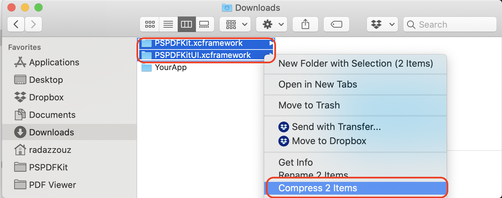
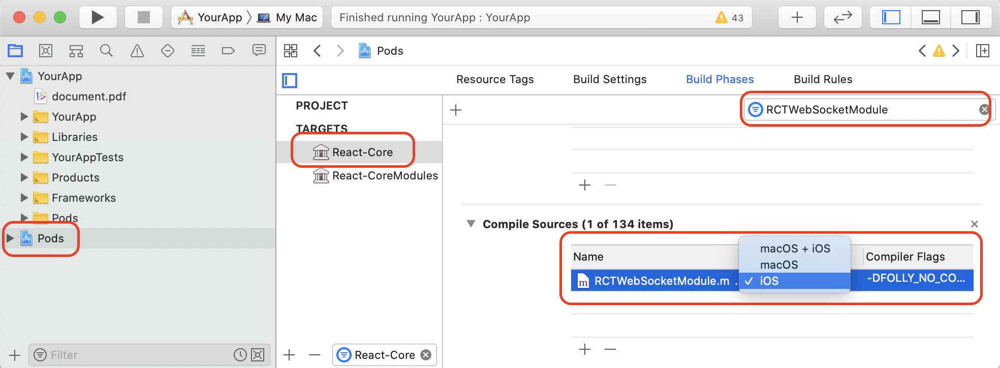
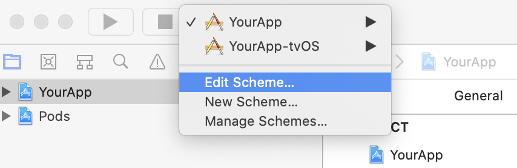
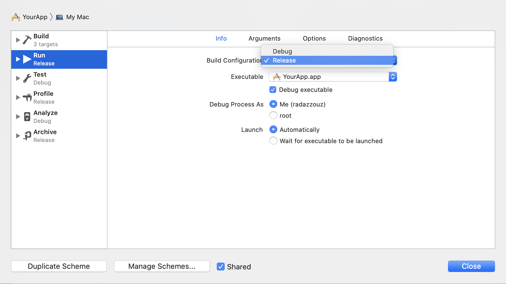
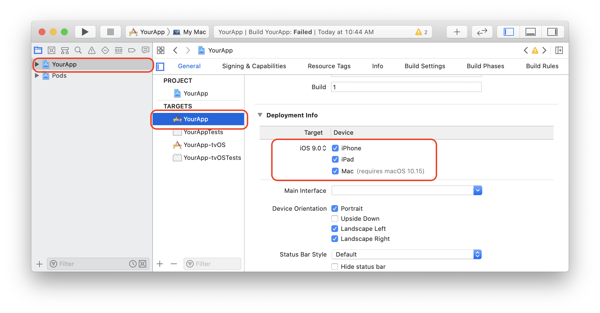
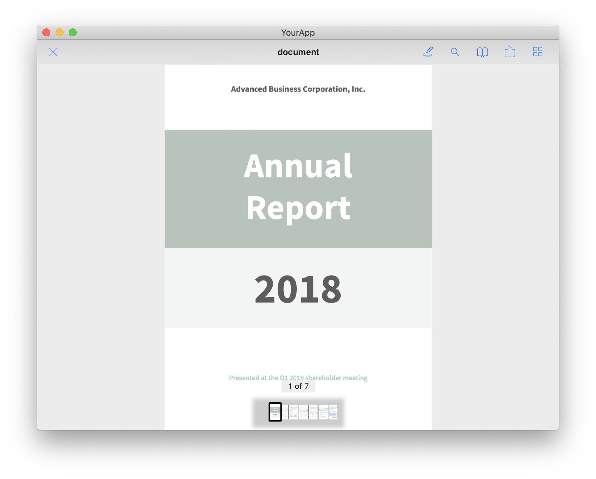

## Experimental Mac Catalyst Support

## Considerations:

- Since React Native 0.60, [new React Native projects use CocoaPods by default](https://facebook.github.io/react-native/blog/2019/07/03/version-60#cocoapods-by-default).
- React Native does not officially support Mac Catalyst. See https://github.com/react-native-community/discussions-and-proposals/issues/131
- At the moment, the latest stable version of CocoaPods (1.8.4) does not support XCFrameworks, which are required for Mac Catalyst. Partial support for XCFrameworks has been added to CocoaPods version 1.9.0.beta.2. See https://github.com/CocoaPods/CocoaPods/issues/9148 for more details.
- In our CocoaPods artifacts, we do not offer XCFrameworks. We plan on offering them as soon as they are fully supported by the latest stable version of CocoaPods. Below, we walk you trough how to create your own local CocoaPods Artifacts that are compatible with XCFrameworks and Mac Catalyst.
- In this tutorial, we discuss how to integrate PSPDFKit in a newly created React Native project. Since the instructions, involve modifying React Native code to make the project compile on Mac Catalyst, the project will on run on macOS and not on iOS.

### Requirements

- Xcode 11.3.1
- PSPDFKit 9.2.0 for iOS or later
- react-native >= 0.61.5
- CocoaPods >= 1.9.0.beta.2

### Getting Started

#### Creating the CocoaPods Artifacts.

1. If you’re an existing customer, download PSPDFKit for iOS from the [customer portal](https://customers.pspdfkit.com/). Otherwise, if you don’t already have PSPDFKit, [sign up for our 60-day trial](https://pspdfkit.com/try/) and you will receive an email with the download instructions.
2. Copy `PSPDFKit.xcframework` and `PSPDFKitUI.xcframework` in a writable location - say the `~/Downloads` folder.
3. Remove `strip-bitcode.sh` and `strip-framework.sh` from `PSPDFKit.xcframework/ios-x86_64-maccatalyst/PSPDFKit.framework`:

```sh
rm PSPDFKit.xcframework/ios-x86_64-maccatalyst/PSPDFKit.framework/strip-bitcode.sh
rm PSPDFKit.xcframework/ios-x86_64-maccatalyst/PSPDFKit.framework/strip-framework.sh
```

3. Select `PSPDFKit.xcframework` and `PSPDFKitUI.xcframework`, right-click on them, then create an archive buy compressing them into a `.zip` file.
	
4. Rename the resulting `Archive.zip` to `PSPDFKit.zip`

#### Integrating PSPDFKit in a New React Native Project

Let's create a simple app that integrates PSPDFKit and uses the `react-native-pspdfkit` module.

1. Make sure `react-native-cli` is installed: `yarn global add react-native-cli`
2. Create the app with `react-native init YourApp`.
3. Step into your newly created app folder: `cd YourApp`
4. Install `react-native-pspdfkit` from GitHub: `yarn add github:PSPDFKit/react-native`
5. Install all the dependencies for the project: `yarn install`. (Because of a [bug](https://github.com/yarnpkg/yarn/issues/2165) you may need to clean `yarn`'s cache with `yarn cache clean` before.)
6. Open `ios/Podile` in a text editor: `open ios/Podfile`, update the platform to iOS 11, and add the CocoaPods URLs.

```diff
- platform :ios, '9.0'
+ platform :ios, '11.0'
require_relative '../node_modules/@react-native-community/cli-platform-ios/native_modules'

target 'YourApp' do
  # Pods for YourApp
  pod 'React', :path => '../node_modules/react-native/'
  pod 'React-Core', :path => '../node_modules/react-native/React'
  pod 'React-DevSupport', :path => '../node_modules/react-native/React'
  pod 'React-fishhook', :path => '../node_modules/react-native/Libraries/fishhook'
  pod 'React-RCTActionSheet', :path => '../node_modules/react-native/Libraries/ActionSheetIOS'
  pod 'React-RCTAnimation', :path => '../node_modules/react-native/Libraries/NativeAnimation'
  pod 'React-RCTBlob', :path => '../node_modules/react-native/Libraries/Blob'
  pod 'React-RCTImage', :path => '../node_modules/react-native/Libraries/Image'
  pod 'React-RCTLinking', :path => '../node_modules/react-native/Libraries/LinkingIOS'
  pod 'React-RCTNetwork', :path => '../node_modules/react-native/Libraries/Network'
  pod 'React-RCTSettings', :path => '../node_modules/react-native/Libraries/Settings'
  pod 'React-RCTText', :path => '../node_modules/react-native/Libraries/Text'
  pod 'React-RCTVibration', :path => '../node_modules/react-native/Libraries/Vibration'
  pod 'React-RCTWebSocket', :path => '../node_modules/react-native/Libraries/WebSocket'

  pod 'React-cxxreact', :path => '../node_modules/react-native/ReactCommon/cxxreact'
  pod 'React-jsi', :path => '../node_modules/react-native/ReactCommon/jsi'
  pod 'React-jsiexecutor', :path => '../node_modules/react-native/ReactCommon/jsiexecutor'
  pod 'React-jsinspector', :path => '../node_modules/react-native/ReactCommon/jsinspector'
  pod 'yoga', :path => '../node_modules/react-native/ReactCommon/yoga'

  pod 'DoubleConversion', :podspec => '../node_modules/react-native/third-party-podspecs/DoubleConversion.podspec'
  pod 'glog', :podspec => '../node_modules/react-native/third-party-podspecs/glog.podspec'
  pod 'Folly', :podspec => '../node_modules/react-native/third-party-podspecs/Folly.podspec'

+ pod 'react-native-pspdfkit', :path => '../node_modules/react-native-pspdfkit'
+ pod 'PSPDFKit', podspec:'PSPDFKit.podspec'

  use_native_modules!
end
```

7. In the `ios` folder, copy the CocoaPods artifatcs that you created earlier: `cp PSPDFKit.zip YourApp/ios/`
8. In the `ios` folder, create a new `PSPDFKit.podspec` file with the following content:

```podspec
Pod::Spec.new do |s|
  s.name                = 'PSPDFKit'
  s.version             = '9.2.0'
  s.homepage            = 'https://pspdfkit.com'
  s.documentation_url   = 'https://pspdfkit.com/guides/ios/current'
  s.license             = { :type => 'Commercial', :file => 'PSPDFKit.xcframework/LICENSE' }
  s.author              = { 'PSPDFKit GmbH' => 'support@pspdfkit.com' }
  s.summary             = 'The leading cross-platform PDF framework.'

  s.description         = <<-DESC
                          The leading cross-platform PDF framework.
                          DESC
  s.screenshots         = 'https://pspdfkit.com/images/devices/ipad-air-hero-07c554d5.png'

  s.platform            = :ios, '11.0'
  s.source              = { :http => 'file:' + __dir__ + '/PSPDFKit.zip' }

  s.library             = 'z', 'sqlite3', 'xml2', 'c++'
  s.xcconfig            = { 'FRAMEWORK_SEARCH_PATHS' => '"$(PODS_ROOT)/PSPDFKit/**"',
                            'HEADER_SEARCH_PATHS' => '$(SDKROOT)/usr/include/libxml2' }
  s.frameworks          = 'QuartzCore', 'CoreText', 'CoreMedia', 'MediaPlayer', 'AVFoundation', 'ImageIO', 'MessageUI',
                          'CoreGraphics', 'Foundation', 'CFNetwork', 'MobileCoreServices', 'SystemConfiguration',
                          'Security', 'UIKit', 'AudioToolbox', 'QuickLook', 'CoreTelephony',
                          'Accelerate', 'CoreImage'
  s.requires_arc        = true
  s.swift_version       = '5.0'
  s.module_name         = 'PSPDFKitSDK'

  s.default_subspec     = 'Core'

  s.subspec 'Core' do |core|
    core.preserve_paths      = 'PSPDFKit.xcframework', 'PSPDFKitUI.xcframework'
    core.public_header_files = 'PSPDFKit.xcframework/ios-arm64/PSPDFKit.framework/Headers/*.h', 'PSPDFKitUI.xcframework/ios-arm64/PSPDFKitUI.framework/Headers/*.h', 'PSPDFKit.xcframework/ios-x86_64-maccatalyst/PSPDFKit.framework/Headers/*.h', 'PSPDFKitUI.xcframework/ios-x86_64-maccatalyst/PSPDFKitUI.framework/Headers/*.h', 'PSPDFKit.xcframework/ios-x86_64-simulator/PSPDFKit.framework/Headers/*.h', 'PSPDFKitUI.xcframework/ios-x86_64-simulator/PSPDFKitUI.framework/Headers/*.h'
    core.vendored_frameworks = 'PSPDFKit.xcframework', 'PSPDFKitUI.xcframework'
  end
end
```

9. `cd ios` then run `pod install`.
10. Open `YourApp.xcworkspace` in Xcode: `open YourApp.xcworkspace`.
11. In Xcode in the Pods Xcode project > React-Core target > Build Phases > Compile Sources > RCTWebSocketModule.m change from `macOS + iOS`to `iOS` only
	
12. Edit your target's scheme and change the build configuration from `Debug` to `Release`. This is a hack to workaround the fact that there are some APIs that are not supported on Mac Catalyst that are ifdef'ed out in the release build configuration:
	
	
13. Allow your target to run on iPad and Mac: 
	
14. Xcode will require you to select a development team in order to enable code signing and generate the right provisioning profiles.
15. Add a PDF by drag and dropping it into your Xcode project (Select "Create groups" and add to target "YourApp"). This will add the document to the "Copy Bundle Resources" build phase:
    
16. Replace the default component from `App.js` with a simple touch area to present the bundled PDF. (Note that you can also use a [Native UI Component](../#native-ui-component) to show a PDF.)

```javascript
import React, { Component } from "react";
import {
  AppRegistry,
  StyleSheet,
  NativeModules,
  Text,
  TouchableHighlight,
  View
} from "react-native";

const PSPDFKit = NativeModules.PSPDFKit;

PSPDFKit.setLicenseKey("INSERT_YOUR_LICENSE_KEY_HERE");

// Change 'YourApp' to your app's name.
export default class YourApp extends Component<Props> {
  _onPressButton() {
    PSPDFKit.present("document.pdf", {});
  }

  render() {
    return (
      <View style={styles.container}>
        <TouchableHighlight onPress={this._onPressButton}>
          <Text style={styles.text}>Tap to Open Document</Text>
        </TouchableHighlight>
      </View>
    );
  }
}

const styles = StyleSheet.create({
  container: {
    flex: 1,
    justifyContent: "center",
    alignItems: "center",
    backgroundColor: "#F5FCFF"
  },
  text: {
    fontSize: 20,
    textAlign: "center",
    margin: 10
  }
});

// Change both 'YourApp's to your app's name.
AppRegistry.registerComponent("YourApp", () => YourApp);
```

Your app is now ready to launch. Run the app in Xcode using `⌘+R`.
	
