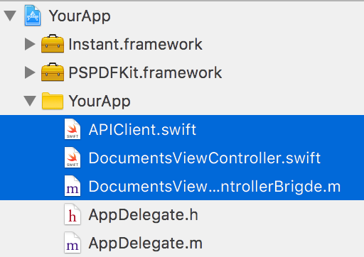
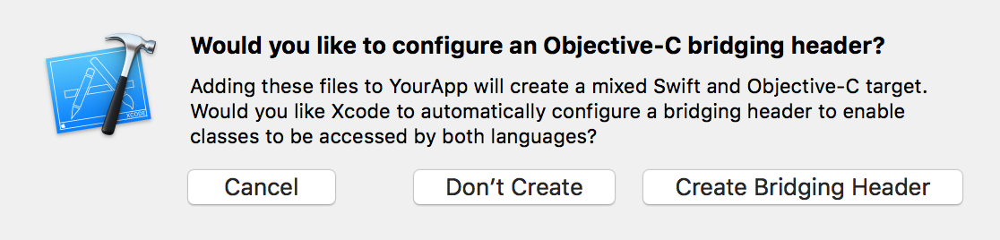

## Instant for React Native

#### Requirements
- Xcode 8.3.3
- react-native >= 0.46.4
- PSPDFKit >= 6.9.2
- Instant >= 6.9.2
- A React Native app which already uses PSPDFKit. See the [getting started guide](https://github.com/PSPDFKit/react-native#getting-started)
- A PSPDFKit Server instance. See the [getting started guide](https://pspdfkit.com/guides/server/current/deployment/getting-started/)

#### Getting Started

1. Make sure you app already integrates PSPDFKit. See the main [README](../../README.md) for the instructions.
2. [Run PSPDFKit Server](https://pspdfkit.com/guides/server/current/deployment/getting-started/) locally.
3. Get one of our example server apps and follow the instructions in its README file. They have the same API.
	* [Ruby on Rails example](https://github.com/pspdfkit/pspdfkit-server-example-rails)
	* [Node.js example](https://github.com/pspdfkit/pspdfkit-server-example-nodejs)
4. In a web browser, log in to the example app with the same user ID the iOS app uses in [DocumentsViewController.swift](https://github.com/PSPDFKit/react-native/blob/master/ios/Instant/DocumentsViewController.swift#L52), which by default is "test".
5. Add a document to the server using the `Upload PDF` button.
6. Select the document to view it with PSPDFKit for Web.
7. Open `YourApp.xcodeproj` in Xcode.
8. Add the following files from the this folder (`ios/Instant/`) to your project:
	* `APIClient.swift`
	* `DocumentsViewController.swift`
	* `DocumentsViewControllerBrigde.m`



Create a bridging header if you don't already have one. Xcode will prompt you to create a bridging header if necessary.



9. Replace the default component from `index.ios.js` with a touch area to start Instant:

```javascript
import React, { Component } from 'react';
import {
  AppRegistry,
  StyleSheet,
  NativeModules,
  Text,
  TouchableHighlight,
  View
} from 'react-native';

var PSPDFKit = NativeModules.PSPDFKit;

PSPDFKit.setLicenseKey('INSERT_YOUR_LICENSE_KEY_HERE');

// Change 'YourApp' to your app's name.
class YourApp extends Component {
  _onPressInstantButton() {
  	var Instant = NativeModules.DocumentsViewController;
  	Instant.startInstant();
  }
  _onPressPSPDFKitButton() {
    PSPDFKit.present('document.pdf', {})
  }
  
  render() {
    return (
      <View style={styles.container}>
        <TouchableHighlight onPress={this._onPressInstantButton}>
          <Text style={styles.text}>Tap to Start Instant</Text>
        </TouchableHighlight>
        <TouchableHighlight onPress={this._onPressPSPDFKitButton}>
          <Text style={styles.text}>Tap to Open Document</Text>
        </TouchableHighlight>
      </View>
    );
  }
}

const styles = StyleSheet.create({
  container: {
    flex: 1,
    justifyContent: 'center',
    alignItems: 'center',
    backgroundColor: '#F5FCFF',
  },
  text: {
    fontSize: 20,
    textAlign: 'center',
    margin: 10,
  }
});

// Change both 'YourApp's to your app's name.
AppRegistry.registerComponent('YourApp', () => YourApp);
```

10. Your app is now ready to launch. Run the app in Xcode or type `react-native run-ios` in the Terminal.
11. When the app launches tap on "Tap to Start Instant". You should see the document list from the server.
12. Tap the document in the app to download and show it.
13. Add annotations in the your app or in the browser to see annotation syncing.
