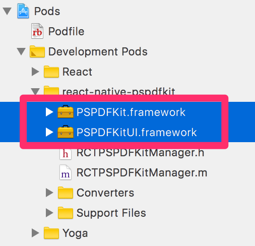
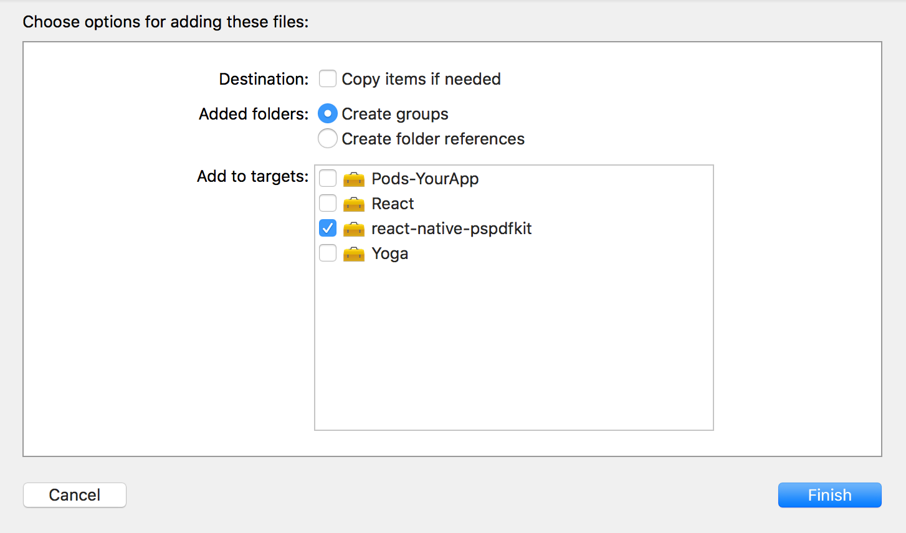
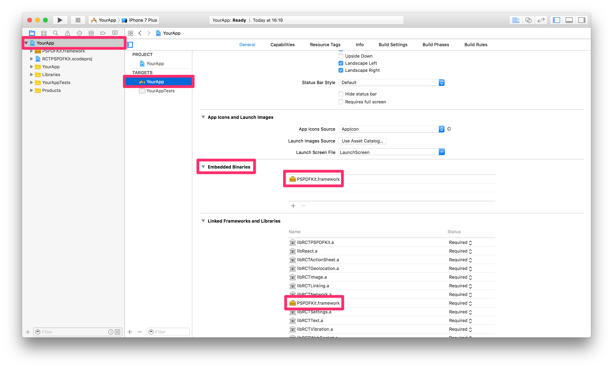

## PSPDFKit for React Native

### CocoaPods integration

#### Requirements
- Xcode 10
- PSPDFKit 8.0 for iOS or later
- react-native >= 0.55.4
- CocoaPods >= 1.5.3

#### Getting Started

Lets create a simple app that integrates PSPDFKit using CocoaPods.

1. Make sure `react-native-cli` is installed: `yarn global add react-native-cli`
2. Create the app with `react-native init YourApp`.
3. Step into your newly created app folder: `cd YourApp`
4. Install `react-native-pspdfkit` from GitHub: `yarn add github:PSPDFKit/react-native`
5. IMPORTANT: Do not link module react-native-pspdfkit: Do not use react-native link react-native-pspdfkit
6. Create the folder `ios/PSPDFKit` and copy `PSPDFKit.framework` and `PSPDFKitUI.framework` into it.
7. Open ios/YourApp.xcodeproj in Xcode: open ios/YourApp.xcodeproj
8. Make sure the deployment target is set to 10.0 or higher: 

9. Change "View controller-based status bar appearance" to YES in Info.plist: 
 deployment-target.png 
10. Close the Xcode project
11. Go back to the Terminal, `cd ios` then run `pod init`
12. Replace the content of your newly created `Podfile` with this:

```podfile
target 'YourApp' do
  use_frameworks!

  pod 'react-native-pspdfkit', :path => '../node_modules/react-native-pspdfkit'

  # To use CocoaPods with React Native, you need to add this specific Yoga spec as well
  pod 'Yoga', :path => '../node_modules/react-native/ReactCommon/yoga/Yoga.podspec'

  # You don't necessarily need all of these subspecs, but this would be a typical setup.
  pod 'React', :path => '../node_modules/react-native', :subspecs => [
    'Core',
    'RCTText',
    'RCTNetwork',
    'RCTWebSocket', # needed for debugging
    'RCTImage',
    'RCTNetwork',
    'BatchedBridge', # https://github.com/facebook/react-native/issues/14749
    # Add any other subspecs you want to use in your project
  ]

  # Add any other dependencies here, including any 3rd party native libraries that you depend on for
  # React Native.
end
```

13. Run `pod install`
14. Open the newly created workspace: `YourApp.workspace`
15. Copy `PSPDFKit.framework` and `PSPDFKitUI.framework` into the Pods folder: `YourApp/ios/Pods`
16. Drag and drop it from the Finder into the `RCTPSPDFKit` group:

17. Add it to the `react-native-pspdfkit` framework:

18. Embed `YourApp/ios/PSPDFKit/PSPDFKit.framework` and `YourApp/ios/PSPDFKit/PSPDFKitUI.framework` (not the copies from `YourApp/ios/Pods/`) by drag and dropping it into the "Embedded Binaries" section of the "YourApp" target (Select "Create groups"). This will also add it to the "Linked Frameworks and Libraries" section:

19. Add a PDF by drag and dropping it into your Xcode project (Select "Create groups" and add to target "YourApp"). This will add the document to the "Copy Bundle Resources" build phase: 

20. Replace the default component from `index.ios.js` with a simple touch area to present the bundled PDF:

```javascript
import React, { Component } from 'react';
import {
  AppRegistry,
  StyleSheet,
  NativeModules,
  Text,
  TouchableHighlight,
  View
} from 'react-native';

var PSPDFKit = NativeModules.PSPDFKit;

PSPDFKit.setLicenseKey('INSERT_YOUR_LICENSE_KEY_HERE');

// Change 'YourApp' to your app's name.
class YourApp extends Component {
  _onPressButton() {
    PSPDFKit.present('document.pdf', {})
  }
  
  render() {
    return (
      <View style={styles.container}>
        <TouchableHighlight onPress={this._onPressButton}>
          <Text style={styles.text}>Tap to Open Document</Text>
        </TouchableHighlight>
      </View>
    );
  }
}

const styles = StyleSheet.create({
  container: {
    flex: 1,
    justifyContent: 'center',
    alignItems: 'center',
    backgroundColor: '#F5FCFF',
  },
  text: {
    fontSize: 20,
    textAlign: 'center',
    margin: 10,
  }
});

// Change both 'YourApp's to your app's name.
AppRegistry.registerComponent('YourApp', () => YourApp);
```

Your app is now ready to launch. Run the app in Xcode or type `react-native run-ios` in the terminal.